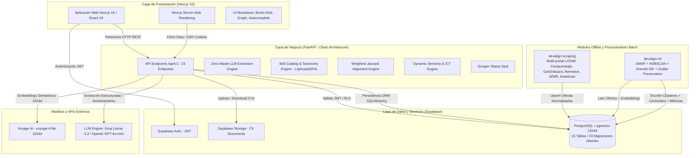
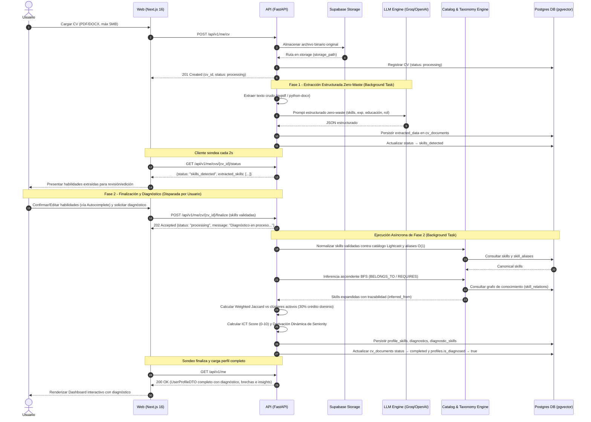
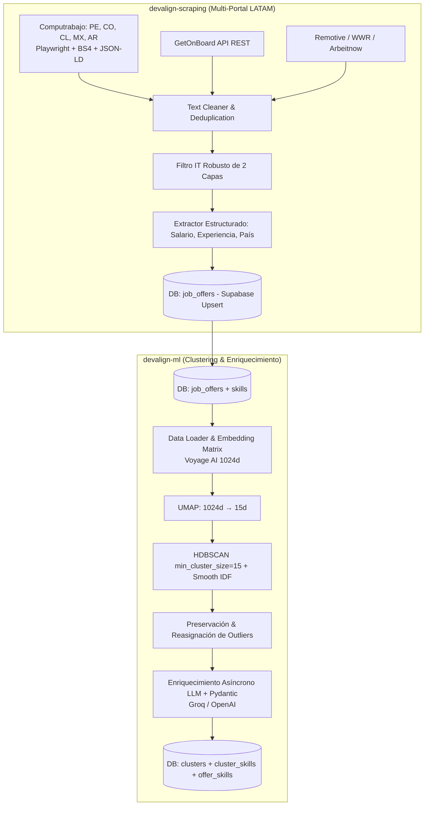

# 🏗️ Arquitectura Técnica

Este documento describe la arquitectura técnica integral del sistema Devalign para el MVP. Detalla la topología de componentes, los flujos de datos síncronos y asíncronos, los módulos del ecosistema y las decisiones clave de infraestructura.

---

## Diagrama de Sistema

El sistema de Devalign se compone de cuatro módulos desacoplados y tres capas de infraestructura administrada.

---

## Flujos de Datos Core

### 1. Flujo Online (Procesamiento, Validación y Diagnóstico de CV)

El procesamiento de currículums opera bajo un patrón de dos fases desacopladas con puerta de validación humana para maximizar la precisión de las habilidades detectadas antes de consolidar el diagnóstico.

### 2. Flujo Offline / Batch (Scraping Multi-Portal y Clustering LATAM)

---

## Componentes del Ecosistema

| Módulo | Repositorio | Tecnologías | Responsabilidad Core |
|---|---|---|---|
| **API Backend** | `devalign-api` | Python 3.12+, FastAPI, SQLAlchemy 2.0 (async), Alembic, Pydantic v2, structlog | Capa de negocio central, endpoints REST, orquestación de LLMs, normalización semántica, inferencia de grafo, cálculo de Weighted Jaccard e ICT Score. |
| **Frontend Web** | `devalign-web` | Next.js 16 (App Router), React 19, Tailwind CSS v4, TypeScript, shadcn/ui, TanStack Query, Zustand, react-force-graph | Interfaz de usuario responsiva en español, visualización de diagnósticos Bento-Grid, radar de afinidades, autocompletado de habilidades y topología de mercado. |
| **Machine Learning** | `devalign-ml` | Python 3.12+, UMAP, HDBSCAN, scikit-learn, Voyage AI SDK, Groq/OpenAI, Pydantic | Pipeline no supervisado offline para reducción dimensional, agrupación de ofertas laborales, cálculo de centroides vectoriales 1024d y etiquetado de clústeres. |
| **Web Scraping** | `devalign-scraping` | Python 3.12+, Playwright, BeautifulSoup4, JSON-LD Parser, httpx | Extracción masiva de ofertas laborales IT en LATAM con control de concurrencia, filtros de relevancia tecnológica y exportación directa a Supabase. |
| **Persistencia & Auth** | `supabase` | PostgreSQL 15+, pgvector (1024d), Supabase Auth (JWT), Supabase Storage | Infraestructura DBaaS administrada, autenticación de desarrolladores y almacenamiento seguro de documentos CV. |

---

## Ambientes y Despliegue

| Ambiente | Capa | Plataforma | Tipo de Servicio | Dominio / URL |
|---|---|---|---|---|
| **Development** | Frontend | Localhost | Node.js (pnpm dev) | `http://localhost:3000` |
| **Development** | Backend | Localhost | Uvicorn (uv run) | `http://localhost:8000` |
| **Development** | Base de Datos | Supabase Cloud | PostgreSQL + pgvector | Instancia Supabase Dev |
| **Production** | Frontend | Vercel | Jamstack / Edge Serverless SSR | `https://devalign.vercel.app` |
| **Production** | Backend | Railway / Koyeb | Docker Container (multi-stage `uv`) | `https://api.devalign.com` |
| **Production** | Base de Datos | Supabase Cloud | Managed PostgreSQL + Storage | Instancia Supabase Prod |

---

## Decisiones Arquitectónicas

> **Decisión 1: SQLAlchemy y Alembic como SSOT Absoluto de la Base de Datos**
> Para garantizar reproducibilidad estricta y control de versiones del esquema relacional, **SQLAlchemy + Alembic** dentro de `devalign-api` actúa como la única fuente de verdad (Single Source of Truth) para la base de datos PostgreSQL. Se gestionan 23 migraciones formales. Supabase se utiliza como proveedor de infraestructura de nube (Postgres, Auth y Storage), evitando migraciones paralelas por Supabase CLI para prevenir desincronizaciones de esquema.

> **Decisión 2: Desacoplamiento Offline de Data Scraping y Clustering**
> La adquisición y el agrupamiento de ofertas de empleo operan de manera completamente desacoplada de la API en línea. `devalign-scraping` y `devalign-ml` se ejecutan como procesos batch y sincronizan datos directamente con PostgreSQL. La API expone un endpoint informativo `/api/v1/scraper/status` sin asumir sobrecarga computacional de scraping o entrenamiento en caliente.

> **Decisión 3: Ecosistema LLM Híbrido y Estabilidad Vectorial Unificada**
> Se mantiene una separación rigurosa entre tareas de generación semántica y operaciones vectoriales:
> 1. **Extracción y Nombramiento Semántico (LLMs):** Alterna dinámicamente según `APP_ENV`. En desarrollo utiliza **Groq** (`llama-3.3-70b-versatile`) para máxima velocidad y cero coste; en producción utiliza **OpenAI** (`gpt-4o-mini`) con structured outputs para garantizar formato JSON sin fisuras.
> 2. **Espacio Vectorial (Embeddings):** Utiliza **Voyage AI** (`voyage-4-lite`, 1024 dimensiones) de forma unificada en todos los entornos, garantizando la invariabilidad de las distancias matemáticas y umbrales de similitud de coseno en `pgvector`.

> **Decisión 4: Procesamiento de CV en Dos Fases con Puerta de Validación Humana**
> En lugar de ejecutar un análisis de caja negra directo a diagnóstico final, el flujo de CV divide el proceso en **Fase 1 (Extracción estructurada `skills_detected`)** y **Fase 2 (Normalización y Diagnóstico `completed`)**. Esto permite al usuario inspeccionar, añadir o retirar habilidades mediante autocompletado antes de calcular la afinidad y persistir brechas.

> **Decisión 5: Taxonomía Basada en Estándares Abiertos (Lightcast, SFIA y SWECOM)**
> El catálogo de habilidades adopta una estructura de gobernanza donde las habilidades conceptuales se mapean a la taxonomía **Lightcast Open Skills**, complementada por marcos SFIA 9 y SWECOM. Esto desacopla las habilidades técnicas accionables de los conceptos sombrilla y estandariza las categorías de mercado.

---

## 🔗 Referencias

- [🤝 Contratos de Interfaz](CONTRACTS.md)
- [🗄️ Modelo de Base de Datos](DATABASE.md)
- [🧠 Lógica Core e Inferencia](MODEL.md)
- [🗺️ Roadmap de Producto](ROADMAP.md)
- [🎯 Alcance MVP](SCOPE.md)
- [📄 Documento de Requerimientos de Producto (PRD)](PRD.md)
- [📋 Product Backlog](PRODUCT_BACKLOG.md)
- [🏃 Sprint Backlog](SPRINT_BACKLOG.md)
