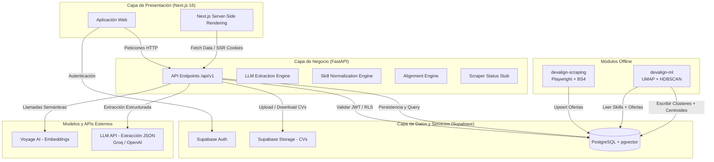
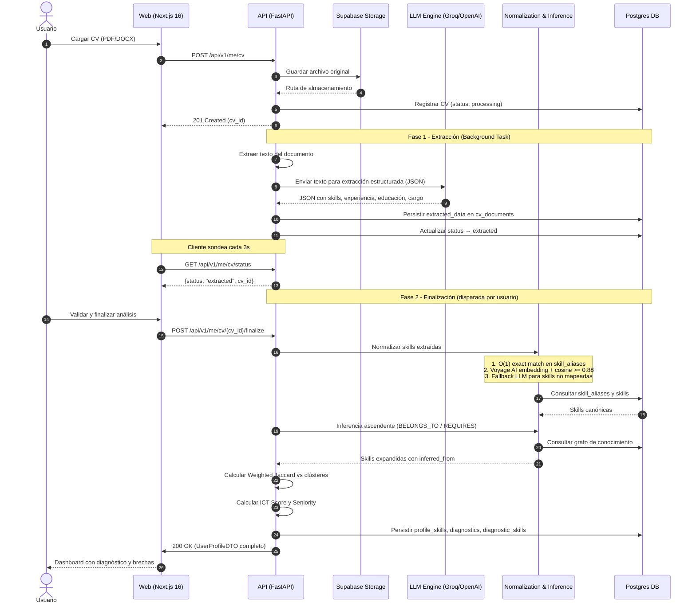
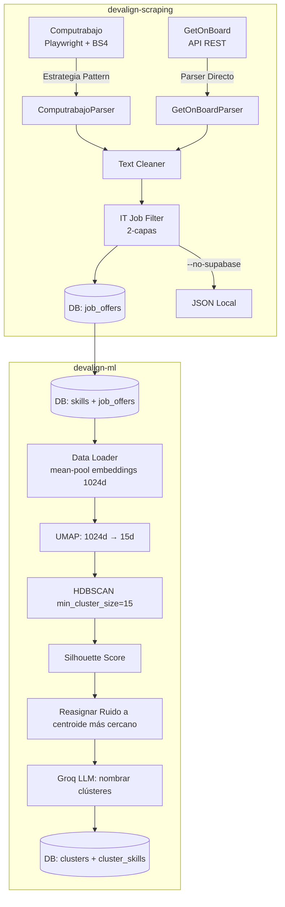

# 🏗️ Arquitectura Técnica

Este documento describe la arquitectura técnica del sistema Devalign para el MVP. Detalla la estructura de componentes, los flujos de datos síncronos y asíncronos, y las decisiones clave de infraestructura.

## Mapa de Arquitectura

El sistema de Devalign se compone de cuatro módulos principales y tres capas de infraestructura.

> **Decisión de Arquitectura 1: SQLAlchemy/Alembic como SSOT de la Base de Datos**
> Para garantizar que el esquema relacional sea robusto, predecible y versionado, se ha determinado que **SQLAlchemy + Alembic** dentro de `devalign-api` actúe como el único origen de verdad (Single Source of Truth) para el esquema en PostgreSQL.
> *Supabase* se utiliza exclusivamente como proveedor de infraestructura gestionada (Postgres, Storage, Auth). No se implementarán migraciones mediante Supabase CLI para evitar inconsistencias de esquema ("split-brain").

---

## Flujos de Datos Core

### 1. Flujo Online (Procesamiento y Diagnóstico de CV)

Este flujo se ejecuta cuando un usuario carga su CV en formato PDF o DOCX a través de la aplicación Web. El procesamiento ocurre en dos fases asíncronas.

### 2. Flujo Offline / Batch (Scraping y Clustering)

> **Decisión de Arquitectura 2: Integración de Scraper Puramente Offline**
> En el MVP, el raspado de vacantes es un proceso desacoplado y fuera de línea. La API de backend expone un endpoint `/api/v1/scraper/status` como stub informativo. Los datos recolectados por `devalign-scraping` se insertan directamente en la base de datos a través del exportador Supabase, eliminando la sobrecarga operativa en el servidor de producción.

> **Decisión de Arquitectura 3: Ecosistema LLM Híbrido y Estabilidad Vectorial**
> El sistema divide las tareas de IA en dos servicios desacoplados:
> 1. **Extracción Semántica (LLMs):** Alterna dinámicamente según `APP_ENV`. En desarrollo, utiliza **Groq** (Llama 3.3 70B) para latencia mínima y cero costes. En producción, utiliza **OpenAI** (gpt-4o-mini) con Structured Outputs para consistencia en el formateo JSON.
> 2. **Normalización y Búsqueda (Embeddings):** Utiliza **Voyage AI** (`voyage-4-lite`) de forma unificada en desarrollo y producción para salvaguardar la estabilidad matemática de los vectores almacenados en PostgreSQL (`pgvector`).

---

## Estrategia de Despliegue

| Componente | Plataforma | Tipo de Servicio | Justificación |
| :--- | :--- | :--- | :--- |
| **Frontend Web** | Vercel | Jamstack / Serverless SSR | Excelente rendimiento en Next.js, caché global en CDN y fácil gestión de variables de entorno. |
| **API Backend** | Railway / Koyeb | Contenedor PaaS (Docker) | Despliegue nativo de FastAPI con auto-escalado simple y monitorización básica de CPU/RAM. |
| **Base de Datos & Auth** | Supabase | DBaaS (PostgreSQL + pgvector) | Postgres gestionado que incluye módulo vector para embeddings de 1024 dimensiones, manejo integrado de autenticación (JWT) y storage de archivos. |

El backend utiliza un Dockerfile multi-stage: builder con `uv` para instalar dependencias y runtime que copia el `.venv` + código fuente. Expone el puerto 8000.

---

## Módulos del Sistema

### devalign-scraping
- Scraper multi-portal: **Computrabajo** (Playwright + BeautifulSoup) y **GetOnBoard** (API REST)
- Patrón Strategy para extensibilidad a nuevos portales
- Rate limiting (2.5-5s Computrabajo, 0.5-1.5s GetOnBoard)
- Checkpoints y auto-resume en interrupción
- Filtro IT de dos capas (pre-filtro título/URL, post-filtro profundo)
- Exportación a Supabase (upsert) o JSON local

### devalign-ml
- Pipeline offline de clustering no supervisado
- Media-pooling de embeddings Voyage AI (1024d) por oferta
- Reducción UMAP (1024d → 15d) + HDBSCAN (min_cluster_size=15)
- Reasignación de ruido al centroide más cercano
- Nombrado de clústeres vía Groq LLM (llama-3.3-70b-versatile)
- Evaluación: Silhouette Score (excluyendo ruido)
- Modos: dry-run (train + eval + plot) y deploy (persistir en Supabase)

### devalign-api
- Arquitectura Clean Architecture con 18 endpoints REST
- Motores: CV parsing (pypdf, python-docx), LLM extraction, skill normalization, upward inference, Weighted Jaccard alignment, ICT scoring, seniority estimation
- 15 tablas SQLAlchemy, 20 migraciones Alembic
- Logging con structlog (pretty console en dev, JSON en prod)

### devalign-web
- Next.js 16 App Router, React 19, Tailwind CSS v4
- shadcn/ui (New York), Framer Motion, Recharts, react-force-graph
- Auth con Supabase SSR, datos con TanStack Query, estado con Zustand
- 6 páginas protegidas + login + landing + términos

---

## Referencias

- [Contratos de Interfaz](CONTRACTS.md)
- [Modelo de Base de Datos](DATABASE.md)
- [Lógica Core e Inferencia](MODEL.md)
- [Roadmap de Producto](ROADMAP.md)
- [Alcance MVP](SCOPE.md)
- [Documento de Requerimientos de Producto (PRD)](PRD.md)
- [Product Backlog](PRODUCT_BACKLOG.md)
- [Sprint Backlog](SPRINT_BACKLOG.md)
