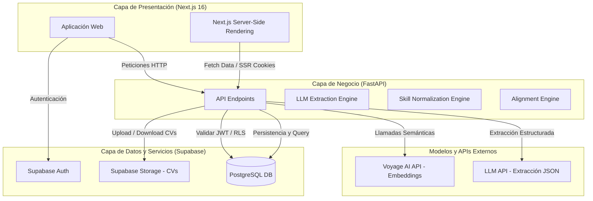
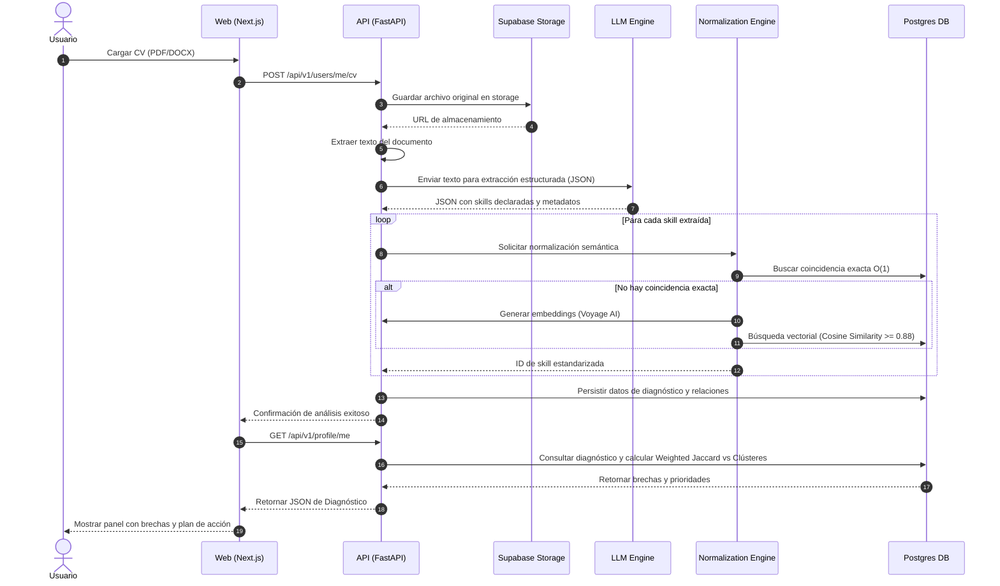
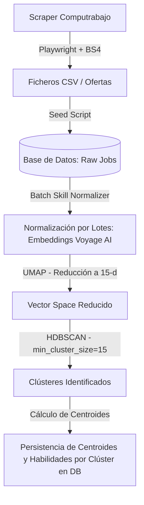

# 🏗️ Arquitectura Técnica - Devalign

Este documento describe la arquitectura técnica del sistema Devalign para el MVP. Detalla la estructura de componentes, los flujos de datos síncronos y asíncronos, y las decisiones clave de infraestructura.

## 🗺️ Mapa de Arquitectura

El sistema de Devalign se compone de tres capas principales: la aplicación web en el cliente, la API de backend, y el proveedor de infraestructura Supabase.

> **Decisión de Arquitectura 1: SQLAlchemy/Alembic como SSOT de la Base de Datos**
> Para garantizar que el esquema relacional sea robusto, predecible y versionado, se ha determinado que **SQLAlchemy + Alembic** dentro de `devalign-api` actúe como el único origen de verdad (Single Source of Truth) para el esquema en PostgreSQL. 
> *Supabase* se utiliza exclusivamente como proveedor de infraestructura gestionada (Postgres, Storage, Auth). No se implementarán migraciones mediante Supabase CLI para evitar inconsistencias de esquema ("split-brain").

---

## 🔄 Flujos de Datos Core

### 1. Flujo Online (Procesamiento y Diagnóstico de CV)

Este flujo se ejecuta de manera síncrona/asíncrona cuando un usuario carga su CV en formato PDF o DOCX a través de la aplicación Web.

### 2. Flujo Offline / Batch (Entrenamiento y Agrupamiento)

Este flujo se ejecuta periódicamente de forma programada o manual mediante scripts de administración de datos en el backend para actualizar los clústeres del mercado.

> **Decisión de Arquitectura 2: Integración de Scraper Puramente Offline**
> En el MVP, el raspado de vacantes de Computrabajo es un proceso desacoplado y fuera de línea. La API de backend no expone endpoints para disparar el scraping en tiempo real. Los datos recolectados se insertan directamente en la base de datos a través de scripts de inicialización (`seed`), eliminando la sobrecarga operativa en el servidor de producción.

---

## 🚀 Estrategia de Despliegue

La infraestructura del MVP está diseñada para ser altamente costo-efectiva, escalable y rápida de implementar utilizando plataformas PaaS modernas:

| Componente | Plataforma | Tipo de Servicio | Justificación |
| :--- | :--- | :--- | :--- |
| **Frontend Web** | Vercel | Jamstack / Serverless SSR | Excelente rendimiento en Next.js, caché global en CDN y fácil gestión de variables de entorno. |
| **API Backend** | Railway / Koyeb | Contenedor PaaS (Docker) | Despliegue nativo de FastAPI con auto-escalado simple y monitorización básica de CPU/RAM. |
| **Base de Datos & Auth** | Supabase | DBaaS (PostgreSQL + pgvector) | Postgres gestionado que incluye módulo vector para embeddings de 1024 dimensiones, manejo integrado de autenticación (JWT) y storage de archivos. |

---

## 🔗 Referencias

- [🤝 Contratos de Interfaz](CONTRACTS.md)
- [🗄️ Modelo de Base de Datos](DATABASE.md)
- [🧠 Lógica Core e Inferencia](MODEL.md)
- [🗺️ Roadmap de Producto](ROADMAP.md)
- [🎯 Alcance MVP](SCOPE.md)
- [📄 Documento de Requerimientos de Producto (PRD)](PRD.md)
- [📋 Product Backlog](PRODUCT_BACKLOG.md)
- [🏃 Sprint Backlog](SPRINT_BACKLOG.md)
