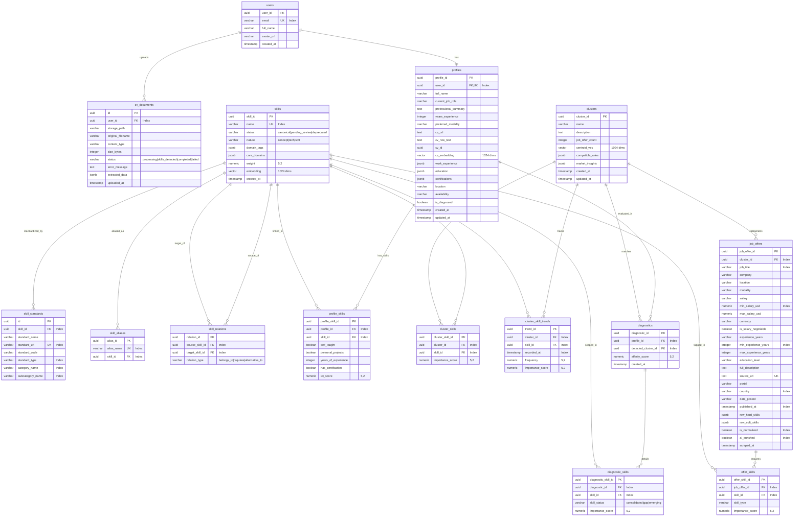

# 🗄️ Modelo de Base de Datos

Este documento define la estructura y el esquema formal de la base de datos relacional de Devalign en PostgreSQL, gestionada mediante **SQLAlchemy 2.0 (async) + Alembic** como única fuente de verdad (Single Source of Truth). El sistema consta de exactamente **15 tablas relacionales** respaldadas por **23 migraciones Alembic**.

---

## Diagrama Entidad-Relación (ERD)

---

## Diccionario de Datos

### 1. `users`
Tabla pública de usuarios sincronizada Just-In-Time con `auth.users` de Supabase.

| Campo | Tipo | Constraints | Descripción |
|---|---|---|---|
| `user_id` | UUID | PK, DEFAULT uuid_generate_v4() | Identificador único del usuario (mapea a `auth.users.id`). |
| `email` | VARCHAR(255) | UNIQUE, NOT NULL, INDEX | Correo electrónico principal. |
| `full_name` | VARCHAR(255) | NULL | Nombre completo desnormalizado para acceso rápido. |
| `avatar_url` | VARCHAR(512) | NULL | URL del avatar provisto por OAuth/perfil. |
| `created_at` | TIMESTAMPTZ | NOT NULL, DEFAULT NOW() | Fecha de registro. |

---

### 2. `cv_documents`
Historial de documentos de currículum cargados y estado de extracción en segundo plano.

| Campo | Tipo | Constraints | Descripción |
|---|---|---|---|
| `id` | UUID | PK, DEFAULT uuid_generate_v4() | Identificador único del documento CV. |
| `user_id` | UUID | FK `users.user_id` ON DELETE CASCADE, NOT NULL, INDEX | Usuario propietario. |
| `storage_path` | VARCHAR(512) | NOT NULL | Ruta del archivo en Supabase Storage bucket. |
| `original_filename`| VARCHAR(255) | NOT NULL | Nombre original del archivo cargado. |
| `content_type` | VARCHAR(128) | NOT NULL | Tipo MIME (`application/pdf`, `application/vnd.openxmlformats...`). |
| `size_bytes` | INTEGER | NOT NULL | Tamaño del archivo en bytes (máximo 5MB). |
| `status` | VARCHAR(50) | NOT NULL, DEFAULT 'processing' | Estado: `processing`, `skills_detected`, `completed`, `failed`. |
| `error_message` | TEXT | NULL | Detalle de error en caso de fallo en extracción o finalización. |
| `extracted_data` | JSONB | NULL | JSON estructurado extraído por LLM (skills, experiencia, etc.). |
| `uploaded_at` | TIMESTAMPTZ | NOT NULL, DEFAULT NOW() | Fecha y hora de carga. |

---

### 3. `profiles`
Perfil profesional consolidado del desarrollador y vector semántico del CV.

| Campo | Tipo | Constraints | Descripción |
|---|---|---|---|
| `profile_id` | UUID | PK, DEFAULT uuid_generate_v4() | Identificador único del perfil. |
| `user_id` | UUID | FK `users.user_id` ON DELETE CASCADE, UNIQUE, NOT NULL, INDEX | Usuario asociado. |
| `full_name` | VARCHAR(150) | NULL | Nombre del desarrollador. |
| `current_job_role` | VARCHAR(100) | NULL | Cargo o rol actual reportado/extraído. |
| `professional_summary` | TEXT | NULL | Resumen ejecutivo del perfil. |
| `years_experience`| INTEGER | NULL | Años totales de experiencia laboral en tecnología. |
| `preferred_modality`| VARCHAR(50) | NULL | Modalidad: `Remoto`, `Híbrido`, `Presencial`. |
| `cv_url` | TEXT | NULL | URL pública o firmada del CV activo. |
| `cv_raw_text` | TEXT | NULL | Texto plano extraído del CV. |
| `cv_id` | UUID | NULL | Referencia al `cv_documents.id` activo. |
| `cv_embedding` | VECTOR(1024) | NULL | Embedding semántico del CV generado con Voyage AI. |
| `work_experience` | JSONB | NOT NULL, DEFAULT '[]' | Lista de empleos anteriores (empresa, rol, fechas, descripción). |
| `education` | JSONB | NOT NULL, DEFAULT '[]' | Historial académico. |
| `certifications` | JSONB | NOT NULL, DEFAULT '[]' | Certificaciones técnicas obtenidas. |
| `location` | VARCHAR(100) | NULL | Ubicación geográfica (`Lima, Perú`, `Remoto LATAM`). |
| `availability` | VARCHAR(100) | NULL | Disponibilidad laboral (`Inmediata`, `1 mes`). |
| `is_diagnosed` | BOOLEAN | NOT NULL, DEFAULT FALSE | `TRUE` una vez completada la Fase 2 de diagnóstico. |
| `created_at` | TIMESTAMPTZ | NOT NULL, DEFAULT NOW() | Fecha de creación del registro. |
| `updated_at` | TIMESTAMPTZ | NOT NULL, DEFAULT NOW() | Última modificación. |

---

### 4. `skills`
Catálogo maestro de habilidades canónicas, gobernanza de taxonomía y embeddings.

| Campo | Tipo | Constraints | Descripción |
|---|---|---|---|
| `skill_id` | UUID | PK, DEFAULT uuid_generate_v4() | Identificador canónico de la habilidad. |
| `name` | VARCHAR(500) | UNIQUE, NOT NULL, INDEX | Nombre canónico estandarizado (ej. `FastAPI`, `PostgreSQL`). |
| `status` | VARCHAR(20) | NOT NULL, DEFAULT 'canonical', INDEX, CHECK (`status IN ('canonical', 'pending_review', 'deprecated')`) | Estado de gobernanza. |
| `nature` | VARCHAR(50) | NULL | Naturaleza: `concept`, `tech`, `soft`. |
| `domain_tags` | JSONB | NOT NULL, DEFAULT '[]' | Etiquetas técnicas secundarias. |
| `core_domains` | JSONB | NOT NULL, DEFAULT '[]' | Macro-dominios principales (ej. `["Backend", "Database"]`). |
| `weight` | NUMERIC(5,2) | NOT NULL, DEFAULT 1.0 | Peso base de importancia de la habilidad. |
| `embedding` | VECTOR(1024) | NULL | Vector de Voyage AI (`voyage-4-lite`) para homologación semántica. |
| `created_at` | TIMESTAMPTZ | NOT NULL, DEFAULT NOW() | Fecha de creación. |

---

### 5. `skill_standards`
Mapeo de habilidades conceptuales a estándares internacionales abiertos (Lightcast Open Skills, SFIA 9, SWECOM).

| Campo | Tipo | Constraints | Descripción |
|---|---|---|---|
| `id` | UUID | PK, DEFAULT uuid_generate_v4() | Identificador único del registro de estándar. |
| `skill_id` | UUID | FK `skills.skill_id` ON DELETE CASCADE, NOT NULL, INDEX | Habilidad canónica mapeada. |
| `standard_name` | VARCHAR(50) | NOT NULL | Nombre del estándar: `Lightcast`, `SFIA`, `SWECOM`. |
| `standard_uri` | VARCHAR(512) | UNIQUE, NOT NULL, INDEX | URI o identificador global del concepto en el estándar. |
| `standard_code` | VARCHAR(50) | NULL | Código formal del estándar (ej. código SFIA o ID Lightcast). |
| `standard_type` | VARCHAR(100) | NULL, INDEX | Tipo en el estándar: `Specialized Skill`, `Common Skill`, `Certification`. |
| `category_name` | VARCHAR(150) | NULL, INDEX | Categoría jerárquica superior (ej. `Information Technology`). |
| `subcategory_name`| VARCHAR(150) | NULL, INDEX | Subcategoría específica (ej. `Software Development`). |

---

### 6. `skill_aliases`
Tabla de sinónimos y variantes ortográficas para resolución exacta $O(1)$.

| Campo | Tipo | Constraints | Descripción |
|---|---|---|---|
| `alias_id` | UUID | PK, DEFAULT uuid_generate_v4() | Identificador único del alias. |
| `alias_name` | VARCHAR(500) | UNIQUE, NOT NULL, INDEX | Texto del alias (ej. `reactjs`, `react.js`, `fast-api`). |
| `skill_id` | UUID | FK `skills.skill_id` ON DELETE CASCADE, NOT NULL, INDEX | Habilidad canónica a la que resuelve. |

---

### 7. `skill_relations`
Aristas del grafo de conocimiento para inferencia jerárquica y dependencias técnicas.

| Campo | Tipo | Constraints | Descripción |
|---|---|---|---|
| `relation_id` | UUID | PK, DEFAULT uuid_generate_v4() | Identificador único de la arista. |
| `source_skill_id`| UUID | FK `skills.skill_id` ON DELETE CASCADE, NOT NULL, INDEX | Nodo origen de la relación. |
| `target_skill_id`| UUID | FK `skills.skill_id` ON DELETE CASCADE, NOT NULL, INDEX | Nodo destino de la relación. |
| `relation_type` | VARCHAR(50) | NOT NULL | Tipo de arista: `belongs_to`, `requires`, `alternative_to`. |

---

### 8. `profile_skills`
Persistencia de las habilidades demostradas o agregadas por el desarrollador con evidencia e ICT Score.

| Campo | Tipo | Constraints | Descripción |
|---|---|---|---|
| `profile_skill_id`| UUID | PK, DEFAULT uuid_generate_v4() | Identificador de la habilidad del usuario. |
| `profile_id` | UUID | FK `profiles.profile_id` ON DELETE CASCADE, NOT NULL, INDEX | Perfil del desarrollador. |
| `skill_id` | UUID | FK `skills.skill_id` ON DELETE CASCADE, NOT NULL, INDEX | Habilidad canónica asociada. |
| `self_taught` | BOOLEAN | NOT NULL, DEFAULT FALSE | Evidencia de aprendizaje autodidacta (+1 pt ICT). |
| `personal_projects`| BOOLEAN | NOT NULL, DEFAULT FALSE | Evidencia en proyectos personales (+2 pts ICT). |
| `years_of_experience`| INTEGER | NOT NULL, DEFAULT 0 | Años de experiencia aplicándola (+3 pts/año ICT). |
| `has_certification`| BOOLEAN | NOT NULL, DEFAULT FALSE | Certificación oficial en la habilidad (+4 pts ICT). |
| `ict_score` | NUMERIC(5,2) | NOT NULL, DEFAULT 0.0 | Índice de competencia técnica calculado (0.0 a 10.0). |

---

### 9. `clusters`
Especialidades y macro-perfiles descubiertos mediante clustering no supervisado en `devalign-ml`.

| Campo | Tipo | Constraints | Descripción |
|---|---|---|---|
| `cluster_id` | UUID | PK, DEFAULT uuid_generate_v4() | Identificador único de la especialidad. |
| `name` | VARCHAR(150) | NOT NULL | Nombre generado por LLM (ej. `Cloud Backend Python`). |
| `description` | TEXT | NULL | Resumen de tecnologías dominantes y volumen de ofertas. |
| `job_offer_count`| INTEGER | NOT NULL, DEFAULT 0 | Total de ofertas clasificadas dentro del clúster. |
| `centroid_vec` | VECTOR(1024) | NULL | Centroide vectorial promedio de las ofertas del clúster. |
| `compatible_roles`| JSONB | NOT NULL, DEFAULT '[]' | Top roles compatibles con nivel de coincidencia. |
| `market_insights` | JSONB | NOT NULL, DEFAULT '{}' | Métricas de crecimiento, demanda y participación de mercado. |
| `created_at` | TIMESTAMPTZ | NOT NULL, DEFAULT NOW() | Fecha de generación del clúster. |
| `updated_at` | TIMESTAMPTZ | NOT NULL, DEFAULT NOW() | Última actualización. |

---

### 10. `cluster_skills`
Habilidades representativas de cada clúster tecnológico y su peso de importancia.

| Campo | Tipo | Constraints | Descripción |
|---|---|---|---|
| `cluster_skill_id`| UUID | PK, DEFAULT uuid_generate_v4() | Identificador de la relación. |
| `cluster_id` | UUID | FK `clusters.cluster_id` ON DELETE CASCADE, NOT NULL, INDEX | Clúster asociado. |
| `skill_id` | UUID | FK `skills.skill_id` ON DELETE CASCADE, NOT NULL, INDEX | Habilidad perteneciente al clúster. |
| `importance_score`| NUMERIC(5,2) | NULL | Importancia relativa calculada ($Frecuencia \times Peso$). |

---

### 11. `cluster_skill_trends`
Histórico de frecuencia e importancia de habilidades para análisis de tendencias temporales.

| Campo | Tipo | Constraints | Descripción |
|---|---|---|---|
| `trend_id` | UUID | PK, DEFAULT uuid_generate_v4() | Identificador de la medición. |
| `cluster_id` | UUID | FK `clusters.cluster_id` ON DELETE CASCADE, NOT NULL, INDEX | Clúster medido. |
| `skill_id` | UUID | FK `skills.skill_id` ON DELETE CASCADE, NOT NULL, INDEX | Habilidad medida. |
| `recorded_at` | TIMESTAMPTZ | NOT NULL, DEFAULT NOW(), INDEX | Fecha del registro temporal. |
| `frequency` | NUMERIC(5,2) | NOT NULL, DEFAULT 0.0 | Frecuencia de aparición (0.0 a 1.0). |
| `importance_score`| NUMERIC(5,2) | NOT NULL, DEFAULT 0.0 | Puntaje de importancia en la fecha. |

---

### 12. `diagnostics`
Resultados de la evaluación de afinidad del desarrollador contra los clústeres del mercado.

| Campo | Tipo | Constraints | Descripción |
|---|---|---|---|
| `diagnostic_id` | UUID | PK, DEFAULT uuid_generate_v4() | Identificador único del diagnóstico. |
| `profile_id` | UUID | FK `profiles.profile_id` ON DELETE CASCADE, NOT NULL, INDEX | Perfil del usuario evaluado. |
| `detected_cluster_id`| UUID | FK `clusters.cluster_id` ON DELETE RESTRICT, NOT NULL, INDEX | Clúster evaluado. |
| `affinity_score` | NUMERIC(5,2) | NOT NULL | Coeficiente Weighted Jaccard obtenido (0.0 a 1.0). |
| `created_at` | TIMESTAMPTZ | NOT NULL, DEFAULT NOW() | Fecha de evaluación. |

---

### 13. `diagnostic_skills`
Detalle de habilidades consolidadas y brechas asociadas a un diagnóstico específico.

| Campo | Tipo | Constraints | Descripción |
|---|---|---|---|
| `diagnostic_skill_id`| UUID | PK, DEFAULT uuid_generate_v4() | Identificador del ítem del diagnóstico. |
| `diagnostic_id` | UUID | FK `diagnostics.diagnostic_id` ON DELETE CASCADE, NOT NULL, INDEX | Diagnóstico asociado. |
| `skill_id` | UUID | FK `skills.skill_id` ON DELETE CASCADE, NOT NULL, INDEX | Habilidad evaluada. |
| `skill_status` | VARCHAR(50) | NOT NULL | Estado en el diagnóstico: `consolidated`, `gap`, `emerging`. |
| `importance_score`| NUMERIC(5,2) | NULL | Peso de importancia de la habilidad en el clúster. |

---

### 14. `job_offers`
Ofertas de empleo IT extraídas por `devalign-scraping` con datos estructurados de mercado.

| Campo | Tipo | Constraints | Descripción |
|---|---|---|---|
| `job_offer_id` | UUID | PK, DEFAULT uuid_generate_v4() | Identificador de la vacante. |
| `cluster_id` | UUID | FK `clusters.cluster_id` ON DELETE SET NULL, NULL, INDEX | Clúster asignado tras el pipeline de ML. |
| `job_title` | VARCHAR(150) | NOT NULL, INDEX | Título de la oferta laboral. |
| `company` | VARCHAR(150) | NULL | Nombre de la empresa ofertante. |
| `location` | VARCHAR(100) | NULL | Ubicación reportada (ej. `Lima, Perú`, `Bogotá, Colombia`). |
| `modality` | VARCHAR(50) | NULL | Modalidad laboral (`Remoto`, `Híbrido`, `Presencial`). |
| `salary` | VARCHAR(100) | NULL | Texto original del salario reportado en el portal. |
| `min_salary_usd` | NUMERIC(10,2) | NULL, INDEX | Salario mínimo estructurado en USD. |
| `max_salary_usd` | NUMERIC(10,2) | NULL | Salario máximo estructurado en USD. |
| `currency` | VARCHAR(10) | NULL | Moneda de origen (`PEN`, `USD`, `COP`, `CLP`, `MXN`). |
| `is_salary_negotiable`| BOOLEAN | NOT NULL, DEFAULT FALSE | Indica si la oferta marca salario a convenir. |
| `experience_years`| VARCHAR(100) | NULL | Texto original de requisitos de experiencia. |
| `min_experience_years`| INTEGER | NULL, INDEX | Años mínimos de experiencia requeridos. |
| `max_experience_years`| INTEGER | NULL | Años máximos de experiencia requeridos. |
| `education_level` | VARCHAR(100) | NULL | Nivel de educación requerido. |
| `full_description`| TEXT | NULL | Descripción completa limpia de la vacante. |
| `source_url` | TEXT | UNIQUE, NOT NULL | URL original única para control de idempotencia y upsert. |
| `portal` | VARCHAR(100) | NULL | Portal de origen (`computrabajo`, `getonboard`, etc.). |
| `country` | VARCHAR(10) | NULL, INDEX | Código de país ISO (`PE`, `CO`, `CL`, `MX`, `AR`). |
| `date_posted` | VARCHAR(50) | NULL | Fecha de publicación en texto original. |
| `published_at` | TIMESTAMPTZ | NULL, INDEX | Fecha de publicación estructurada. |
| `raw_hard_skills` | JSONB | NULL | Lista cruda de habilidades técnicas extraídas por scraping. |
| `raw_soft_skills` | JSONB | NULL | Lista cruda de habilidades blandas extraídas por scraping. |
| `is_normalized` | BOOLEAN | NOT NULL, DEFAULT FALSE, INDEX | Indica si las habilidades crudas fueron normalizadas. |
| `ai_enriched` | BOOLEAN | NOT NULL, DEFAULT FALSE, INDEX | Indica si la oferta fue procesada por enriquecimiento LLM. |
| `scraped_at` | TIMESTAMPTZ | NOT NULL, DEFAULT NOW() | Fecha de extracción en el scraper. |

---

### 15. `offer_skills`
Tabla de unión que vincula ofertas laborales con habilidades canónicas normalizadas.

| Campo | Tipo | Constraints | Descripción |
|---|---|---|---|
| `offer_skill_id` | UUID | PK, DEFAULT uuid_generate_v4() | Identificador de la unión. |
| `job_offer_id` | UUID | FK `job_offers.job_offer_id` ON DELETE CASCADE, NOT NULL, INDEX | Oferta asociada. |
| `skill_id` | UUID | FK `skills.skill_id` ON DELETE CASCADE, NOT NULL, INDEX | Habilidad canónica normalizada. |
| `skill_type` | VARCHAR(50) | NOT NULL | Tipo: `hard_skill`, `soft_skill`, `methodology`, `tool`. |
| `importance_score`| NUMERIC(5,2) | NULL | Relevancia en la oferta laboral. |

---

## Migraciones Alembic del Sistema (23 Migraciones)

| Orden | Revisión | Nombre de Migración | Impacto en Esquema |
|---|---|---|---|
| 1 | `001` | `create_all_tables` | Creación inicial de las 13 tablas base del sistema. |
| 2 | `002` | `add_is_normalized_to_job_offers` | Agrega flag `is_normalized` en `job_offers`. |
| 3 | `0e407f4cfc27` | `user_sync_and_rls` | Sincronización JIT con `auth.users` y políticas de RLS. |
| 4 | `3e85e88d6528` | `alter_vector_dimensions` | Ajuste de dimensiones pgvector a 1024 (Voyage AI). |
| 5 | `af8815637327` | `add_cv_id_to_profiles` | Agrega FK referencial `cv_id` en `profiles`. |
| 6 | `6d3f97e10a1d` | `add_status_to_cv_documents` | Columna `status` en `cv_documents`. |
| 7 | `fcdbbaaaa6c7` | `add_extracted_data_to_cv_documents` | JSONB `extracted_data` en `cv_documents`. |
| 8 | `a1b2c3d4e5f6` | `add_is_diagnosed_to_profiles` | Flag `is_diagnosed` en `profiles`. |
| 9 | `c412290f9981` | `extend_profiles_table` | Agrega campos de perfil: ubicación, disponibilidad, resúmenes. |
| 10 | `91474942c0b8` | `knowledge_graph_skills` | Creación de aristas en `skill_relations`. |
| 11 | `6e185a40579f` | `add_embedding_to_skills` | Vector 1024d en la tabla `skills`. |
| 12 | `6f7738c1f473` | `add_skill_weight_and_cluster_offer_count` | Peso en `skills` y conteo en `clusters`. |
| 13 | `6e80d94abe6a` | `add_domain_and_cluster_insights` | Campos de dominio e insights JSONB en `clusters`. |
| 14 | `75e453970cbd` | `increase_skill_name_length` | Extiende longitud de `skills.name` a VARCHAR(500). |
| 15 | `cd103c833107` | `increase_alias_name_length` | Extiende `skill_aliases.alias_name` a VARCHAR(500). |
| 16 | `42d733c42950` | `add_esco_and_ict_evidence_fields` | Evidencias e ICT score en `profile_skills`. |
| 17 | `9354eebfaceb` | `create_profile_skills_table` | Tabla formal `profile_skills`. |
| 18 | `55774ba07a3f` | `remove_esco_uri_and_add_skill_standards` | Elimina `esco_uri` de `skills` y crea `skill_standards`. |
| 19 | `55d42b6b1ed3` | `add_skill_status_and_custom_standards` | Columna `status` en `skills` (`canonical`, etc.). |
| 20 | `dbd782abdd17` | `add_core_domains_to_skills` | Campos `core_domains` y `domain_tags` en `skills`. |
| 21 | `1cd3761eb205` | `add_ai_enriched_to_job_offers` | Flag `ai_enriched` en `job_offers`. |
| 22 | `29c892425359` | `add_country_to_job_offers` | Campo `country` en `job_offers`. |
| 23 | `8a7b6c5d4e3f` | `add_structured_market_fields_to_job_offers` | Campos salariales y de experiencia en USD en `job_offers`. |

---

## 🔗 Referencias

- [🏗️ Arquitectura Técnica](ARCHITECTURE.md)
- [🤝 Contratos de Interfaz](CONTRACTS.md)
- [🧠 Lógica Core e Inferencia](MODEL.md)
- [🗺️ Roadmap de Producto](ROADMAP.md)
- [🎯 Alcance MVP](SCOPE.md)
- [📄 Documento de Requerimientos de Producto (PRD)](PRD.md)
- [📋 Product Backlog](PRODUCT_BACKLOG.md)
- [🏃 Sprint Backlog](SPRINT_BACKLOG.md)
