# 🗄️ Modelo de Base de Datos - Devalign

Este documento define la estructura y el esquema de la base de datos relacional de Devalign para el MVP, implementada en PostgreSQL y gestionada a través de SQLAlchemy + Alembic como SSOT.

## 🗺️ Diagrama Entidad-Relación (ERD)

El siguiente diagrama detalla las entidades principales del sistema y sus relaciones.

```mermaid
erDiagram
    users {
        uuid id PK
        varchar email UK
        varchar name
        timestamp created_at
        timestamp updated_at
        boolean is_active
    }
    profiles {
        uuid id PK
        uuid user_id FK
        varchar title
        varchar experience_level
        timestamp updated_at
    }
    cv_documents {
        uuid id PK
        uuid user_id FK
        varchar storage_url
        varchar file_name
        varchar status
        text extracted_text
        timestamp uploaded_at
    }
    skills {
        uuid id PK
        varchar name UK
        varchar category
        vector(1024) embedding
        timestamp created_at
    }
    skill_aliases {
        uuid id PK
        uuid skill_id FK
        varchar alias UK
    }
    skill_relations {
        uuid id PK
        uuid source_skill_id FK
        uuid target_skill_id FK
        varchar relation_type
    }
    clusters {
        uuid id PK
        varchar name UK
        vector(1024) centroid
        timestamp updated_at
    }
    cluster_skills {
        uuid cluster_id PK, FK
        uuid skill_id PK, FK
        float weight
        float frequency_in_cluster
    }
    diagnostics {
        uuid id PK
        uuid user_id FK
        uuid cluster_id FK
        float similarity_score
        timestamp created_at
    }
    diagnostic_skills {
        uuid diagnostic_id PK, FK
        uuid skill_id PK, FK
        varchar status
    }
```

---

## 🗂️ Diccionario de Datos (Entidades Core)

### 1. Tabla `users`
Almacena la información de cuenta sincronizada desde Supabase Auth.
* `id` (`UUID`, Primary Key): Identificador único de usuario.
* `email` (`VARCHAR(255)`, Unique): Correo electrónico del usuario.
* `name` (`VARCHAR(255)`, Nullable): Nombre completo del usuario.
* `created_at` (`TIMESTAMP WITH TIME ZONE`): Fecha de creación del registro.
* `updated_at` (`TIMESTAMP WITH TIME ZONE`): Fecha de última modificación.
* `is_active` (`BOOLEAN`): Estado de activación del usuario.

### 2. Tabla `profiles`
Contiene la información profesional del usuario autenticado.
* `id` (`UUID`, Primary Key): Identificador de perfil.
* `user_id` (`UUID`, Foreign Key → `users.id`): Relación de pertenencia.
* `title` (`VARCHAR(255)`): Título profesional principal (ej: Backend Developer).
* `experience_level` (`VARCHAR(50)`): Nivel inferido (Junior, Semi-Senior, Senior).
* `updated_at` (`TIMESTAMP WITH TIME ZONE`): Última recalculación del perfil.

### 3. Tabla `cv_documents`
Almacena el historial de cargas de currículums.
* `id` (`UUID`, Primary Key): Identificador de documento.
* `user_id` (`UUID`, Foreign Key → `users.id`): Usuario que cargó el CV.
* `storage_url` (`VARCHAR(512)`): Enlace directo al archivo original en Supabase Storage.
* `file_name` (`VARCHAR(255)`): Nombre original del archivo.
* `status` (`VARCHAR(50)`): Estado del procesamiento (processing, completed, failed).
* `extracted_text` (`TEXT`): Texto crudo extraído para procesamiento del LLM.
* `uploaded_at` (`TIMESTAMP WITH TIME ZONE`): Fecha de carga.

### 4. Tabla `skills`
Catálogo estandarizado de habilidades técnicas del sistema.
* `id` (`UUID`, Primary Key): Identificador único de habilidad.
* `name` (`VARCHAR(150)`, Unique): Nombre normalizado (ej: "PostgreSQL").
* `category` (`VARCHAR(100)`): Área (Languages, Frameworks, Databases, DevOps, etc.).
* `embedding` (`VECTOR(1024)`): Representación semántica densa de la habilidad generada por Voyage AI.
* `created_at` (`TIMESTAMP WITH TIME ZONE`): Fecha de inserción.

### 5. Tabla `skill_aliases`
Soporta mapeos rápidos O(1) de sinónimos comunes hacia habilidades estandarizadas.
* `id` (`UUID`, Primary Key): Identificador.
* `skill_id` (`UUID`, Foreign Key → `skills.id`): Habilidad de destino.
* `alias` (`VARCHAR(150)`, Unique): Variante o término común (ej: "postgres" → PostgreSQL).

### 6. Tabla `skill_relations`
Estructura de grafo de afinidades y jerarquías entre habilidades.
* `id` (`UUID`, Primary Key): Identificador.
* `source_skill_id` (`UUID`, Foreign Key → `skills.id`): Habilidad origen.
* `target_skill_id` (`UUID`, Foreign Key → `skills.id`): Habilidad destino.
* `relation_type` (`VARCHAR(50)`): Relación semántica (ej: "framework_of", "deploys_with").

### 7. Tabla `clusters`
Guarda la información de agrupamientos del mercado laboral laboral tras el procesamiento UMAP/HDBSCAN offline.
* `id` (`UUID`, Primary Key): Identificador del clúster.
* `name` (`VARCHAR(255)`, Unique): Nombre descriptivo asignado al clúster (ej: "Python Cloud Backend").
* `centroid` (`VECTOR(1024)`): Vector centroide del clúster en el espacio de 1024 dimensiones.
* `updated_at` (`TIMESTAMP WITH TIME ZONE`): Fecha del último entrenamiento offline.

### 8. Tabla `cluster_skills`
Tabla asociativa que representa las habilidades presentes en un clúster de mercado y sus métricas de relevancia.
* `cluster_id` (`UUID`, Primary Key, Foreign Key → `clusters.id`)
* `skill_id` (`UUID`, Primary Key, Foreign Key → `skills.id`)
* `weight` (`FLOAT`): Peso / importancia de la habilidad dentro del clúster.
* `frequency_in_cluster` (`FLOAT`): Frecuencia de aparición de la habilidad en ofertas laborales del clúster.

### 9. Tabla `diagnostics`
Historial de alineaciones calculadas para los usuarios.
* `id` (`UUID`, Primary Key)
* `user_id` (`UUID`, Foreign Key → `users.id`)
* `cluster_id` (`UUID`, Foreign Key → `clusters.id`): Clúster objetivo con el cual se comparó.
* `similarity_score` (`FLOAT`): Grado de alineación ($0.0$ a $1.0$).
* `created_at` (`TIMESTAMP WITH TIME ZONE`): Fecha de cálculo.

### 10. Tabla `diagnostic_skills`
Habilidades evaluadas durante un diagnóstico y su estado de cumplimiento.
* `diagnostic_id` (`UUID`, Primary Key, Foreign Key → `diagnostics.id`)
* `skill_id` (`UUID`, Primary Key, Foreign Key → `skills.id`)
* `status` (`VARCHAR(50)`): Clasificación de la habilidad (ej: "current", "missing").

---

## 🔮 MVP vs Alcance Futuro

Para evitar el sobrediseño y la complejidad innecesaria en el MVP, se establece la siguiente separación técnica a nivel base de datos:

### Implementado en el MVP
- Almacenamiento de usuarios, perfiles, documentos extraídos, catálogo normalizado de habilidades, sinónimos y agrupamientos estáticos de clústeres.
- Mapeo directo de brechas del usuario vs clúster.

### Clasificado como Alcance Futuro (Post-MVP)
- **Tabla `roadmaps`**: Almacena el grafo interactivo y jerárquico de aprendizaje generado de manera asíncrona mediante un LLM.
- **Tabla `roadmap_steps`**: Pasos específicos, enlaces de recursos educativos y estado de avance del aprendizaje interactivo.
- **Tablas de Historial de Búsquedas e Interacciones**: Métricas de clics del usuario en recomendaciones y telemetría de navegación de aprendizaje.

---

## 🔗 Referencias

- [🏗️ Arquitectura Técnica](ARCHITECTURE.md)
- [🤝 Contratos de Interfaz](CONTRACTS.md)
- [🧠 Lógica Core e Inferencia](MODEL.md)
- [🗺️ Roadmap de Producto](ROADMAP.md)
- [🎯 Alcance MVP](SCOPE.md)
