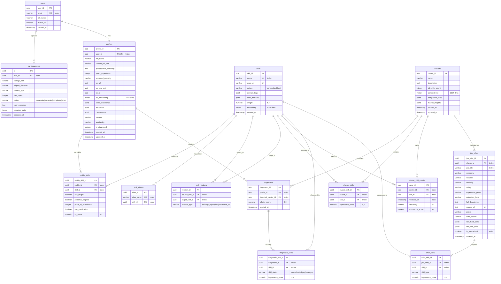

# 🗄️ Modelo de Base de Datos

Este documento define la estructura y el esquema de la base de datos relacional de Devalign, implementada en PostgreSQL y gestionada a través de SQLAlchemy + Alembic como SSOT (Single Source of Truth). Contiene 15 tablas activas con 18 migraciones aplicadas.

## Diagrama Entidad-Relación (ERD)

---

## Diccionario de Datos

### 1. Tabla `users`
Metadatos de usuario sincronizados desde Supabase Auth en el aprovisionamiento JIT.
- `user_id` (`UUID`, PK): Identificador del usuario provisto por Supabase.
- `email` (`VARCHAR(255)`, Unique, Indexed): Correo electrónico del usuario.
- `full_name` (`VARCHAR(255)`, Nullable): Nombre completo.
- `avatar_url` (`VARCHAR(512)`, Nullable): Enlace a la foto de perfil.
- `created_at` (`TIMESTAMP WITH TIME ZONE`): Fecha de creación del registro.

### 2. Tabla `profiles`
Información profesional consolidada del desarrollador.
- `profile_id` (`UUID`, PK): Identificador único de perfil.
- `user_id` (`UUID`, FK → `users.user_id`, Unique): Relación 1:1 con la cuenta.
- `full_name` (`VARCHAR(150)`, Nullable): Nombre para despliegue en CV.
- `current_job_role` (`VARCHAR(100)`, Nullable): Puesto actual.
- `professional_summary` (`TEXT`, Nullable): Resumen profesional extraído del CV.
- `years_experience` (`INTEGER`, Nullable): Años totales de experiencia.
- `preferred_modality` (`VARCHAR(50)`, Nullable): Remoto, Presencial, Híbrido.
- `cv_url` (`TEXT`, Nullable): URL del CV activo.
- `cv_raw_text` (`TEXT`, Nullable): Texto completo extraído del CV.
- `cv_id` (`UUID`, Nullable): ID del documento CV activo.
- `cv_embedding` (`VECTOR(1024)`, Nullable): Embedding Voyage AI del CV.
- `work_experience` (`JSONB`, default `[]`): Historial de trabajos.
- `education` (`JSONB`, default `[]`): Educación académica.
- `certifications` (`JSONB`, default `[]`): Certificaciones.
- `location` (`VARCHAR(100)`, Nullable): Ubicación física.
- `availability` (`VARCHAR(100)`, Nullable): Disponibilidad.
- `is_diagnosed` (`BOOLEAN`, default `false`): Indica si tiene diagnóstico calculado.
- `created_at`, `updated_at` (`TIMESTAMP WITH TIME ZONE`).

### 3. Tabla `cv_documents`
Registro histórico de cargas de archivos CV.
- `id` (`UUID`, PK): Identificador del documento.
- `user_id` (`UUID`, FK → `users.user_id`): Propietario del archivo.
- `storage_path` (`VARCHAR(512)`): Ruta en Supabase Storage.
- `original_filename` (`VARCHAR(255)`): Nombre original del archivo.
- `content_type` (`VARCHAR(128)`): Tipo MIME (`application/pdf`, etc.).
- `size_bytes` (`INTEGER`): Tamaño en bytes.
- `status` (`VARCHAR(50)`, default `"processing"`): Estado del procesamiento (`processing`, `extracted`, `completed`, `error`).
- `error_message` (`TEXT`, Nullable): Mensaje de error si el procesamiento falló.
- `extracted_data` (`JSONB`, Nullable): Datos extraídos por el LLM (JSON estructurado).
- `uploaded_at` (`TIMESTAMP WITH TIME ZONE`): Fecha de subida.

### 4. Tabla `skills`
Catálogo maestro normalizado de habilidades IT.
- `skill_id` (`UUID`, PK): Identificador único.
- `name` (`VARCHAR(500)`, Unique, Indexed): Nombre estandarizado.
- `esco_uri` (`VARCHAR(255)`, Unique, Nullable): URI de ESCO (clasificación europea de habilidades).
- `nature` (`VARCHAR(50)`, Nullable): Tipo (`concept`, `tech` o `soft`).
- `domain_tags` (`JSONB`, default `[]`): Etiquetas semánticas (`["frontend", "web"]`).
- `core_domains` (`JSONB`, default `[]`): Dominios principales.
- `weight` (`NUMERIC(5,2)`, default `1.00`): Importancia global de la habilidad.
- `embedding` (`VECTOR(1024)`, Nullable): Vector Voyage AI.
- `created_at` (`TIMESTAMP WITH TIME ZONE`).

### 5. Tabla `profile_skills`
Relación entre un perfil y sus habilidades adquiridas, con métricas de competencia ICT.
- `profile_skill_id` (`UUID`, PK).
- `profile_id` (`UUID`, FK → `profiles.profile_id`).
- `skill_id` (`UUID`, FK → `skills.skill_id`).
- `self_taught` (`BOOLEAN`, default `false`): Aprendizaje autodidacta.
- `personal_projects` (`BOOLEAN`, default `false`): Proyectos personales.
- `years_of_experience` (`INTEGER`, default `0`): Años de experiencia con la skill.
- `has_certification` (`BOOLEAN`, default `false`): Certificación formal.
- `ict_score` (`NUMERIC(5,2)`, default `0.0`): Puntaje ICT calculado.

### 6. Tabla `skill_aliases`
Sinónimos hacia la taxonomía oficial (búsqueda O(1)).
- `alias_id` (`UUID`, PK).
- `alias_name` (`VARCHAR(500)`, Unique, Indexed): Variante ortográfica.
- `skill_id` (`UUID`, FK → `skills.skill_id`): Habilidad canónica.

### 7. Tabla `skill_relations`
Grafo de conocimiento del mercado.
- `relation_id` (`UUID`, PK).
- `source_skill_id` (`UUID`, FK → `skills.skill_id`): Habilidad origen.
- `target_skill_id` (`UUID`, FK → `skills.skill_id`): Habilidad destino.
- `relation_type` (`VARCHAR(50)`): Tipo de arco (`belongs_to`, `requires`, `alternative_to`).

### 8. Tabla `clusters`
Especialidades tecnológicas del mercado identificadas por UMAP/HDBSCAN.
- `cluster_id` (`UUID`, PK).
- `name` (`VARCHAR(150)`): Nombre descriptivo.
- `description` (`TEXT`, Nullable): Resumen del stack tecnológico.
- `job_offer_count` (`INTEGER`, default `0`): Ofertas agrupadas en el clúster.
- `centroid_vec` (`VECTOR(1024)`, Nullable): Vector centroide.
- `compatible_roles` (`JSONB`, default `[]`): Puestos coincidentes con el stack.
- `market_insights` (`JSONB`, default `{}`): Información salarial y demanda.
- `created_at`, `updated_at`.

### 9. Tabla `cluster_skills`
Relación entre clúster y habilidades con peso de relevancia.
- `cluster_skill_id` (`UUID`, PK).
- `cluster_id` (`UUID`, FK → `clusters.cluster_id`).
- `skill_id` (`UUID`, FK → `skills.skill_id`).
- `importance_score` (`NUMERIC(5,2)`, Nullable): Peso de la habilidad en el clúster.

### 10. Tabla `cluster_skill_trends`
Tendencias temporales de habilidades dentro de los clústeres.
- `trend_id` (`UUID`, PK).
- `cluster_id` (`UUID`, FK → `clusters.cluster_id`).
- `skill_id` (`UUID`, FK → `skills.skill_id`).
- `recorded_at` (`TIMESTAMP WITH TIME ZONE`, Indexed): Momento de la medición.
- `frequency` (`NUMERIC(5,2)`, default `0.0`): Frecuencia en el período.
- `importance_score` (`NUMERIC(5,2)`, default `0.0`): Importancia en el período.

### 11. Tabla `diagnostics`
Historial de diagnósticos de alineación profesional.
- `diagnostic_id` (`UUID`, PK).
- `profile_id` (`UUID`, FK → `profiles.profile_id`).
- `detected_cluster_id` (`UUID`, FK → `clusters.cluster_id`).
- `affinity_score` (`NUMERIC(5,2)`): Coeficiente de alineación (0.0 a 1.0).
- `created_at`.

### 12. Tabla `diagnostic_skills`
Habilidades analizadas en un diagnóstico y su clasificación de brecha.
- `diagnostic_skill_id` (`UUID`, PK).
- `diagnostic_id` (`UUID`, FK → `diagnostics.diagnostic_id`).
- `skill_id` (`UUID`, FK → `skills.skill_id`).
- `skill_status` (`VARCHAR(50)`): `consolidated`, `gap` o `emerging`.
- `importance_score` (`NUMERIC(5,2)`, Nullable).

### 13. Tabla `job_offers`
Ofertas laborales scrapeadas del mercado.
- `job_offer_id` (`UUID`, PK).
- `cluster_id` (`UUID`, FK → `clusters.cluster_id`, Nullable): Clúster asignado.
- `job_title` (`VARCHAR(150)`, Indexed): Título de la oferta.
- `company` (`VARCHAR(150)`, Nullable): Empresa.
- `location` (`VARCHAR(100)`, Nullable): Ubicación.
- `modality` (`VARCHAR(50)`, Nullable): Remoto, Presencial, Híbrido.
- `salary` (`VARCHAR(100)`, Nullable): Rango salarial.
- `experience_years` (`VARCHAR(100)`, Nullable): Experiencia requerida.
- `education_level` (`VARCHAR(100)`, Nullable): Nivel educativo.
- `full_description` (`TEXT`, Nullable): Descripción completa.
- `source_url` (`TEXT`, Unique): URL de la oferta.
- `portal` (`VARCHAR(100)`, Nullable): Portal de origen.
- `date_posted` (`VARCHAR(50)`, Nullable): Fecha de publicación.
- `raw_hard_skills` (`JSONB`, Nullable): Habilidades técnicas crudas.
- `raw_soft_skills` (`JSONB`, Nullable): Habilidades blandas crudas.
- `is_normalized` (`BOOLEAN`, default `false`, Indexed): Si fue procesada por el normalizador.
- `scraped_at`: Fecha de scraping.

### 14. Tabla `offer_skills`
Habilidades normalizadas asociadas a ofertas laborales.
- `offer_skill_id` (`UUID`, PK).
- `job_offer_id` (`UUID`, FK → `job_offers.job_offer_id`).
- `skill_id` (`UUID`, FK → `skills.skill_id`).
- `skill_type` (`VARCHAR(50)`): Tipo de habilidad.
- `importance_score` (`NUMERIC(5,2)`, Nullable).

### 15. Tabla `roadmaps` (DROPPED)
La tabla `roadmaps` fue creada en la migración inicial y eliminada en la migración `6e185a40579f`. Ya no existe en el esquema.

---

## MVP vs Alcance Futuro

### Implementado en el MVP
- 15 tablas activas: usuarios, perfiles, CVs, skills, aliases, relaciones de grafo, clústeres, diagnostico, ofertas laborales y tendencias.
- Métricas ICT (autodidacta, proyectos, experiencia, certificación) en `profile_skills`.
- ESCO URI para estandarización europea de habilidades.
- Seguimiento de estado de procesamiento de CVs.
- Pipeline completo de scraping a clústeres.

### Clasificado como Alcance Futuro (Post-MVP)
- **Tabla `roadmaps`**: Planes de estudio interactivos generados por LLM.
- **Tabla `roadmap_steps`**: Pasos de estudio con recursos externos y avance.

---

## Referencias

- [Arquitectura Técnica](ARCHITECTURE.md)
- [Contratos de Interfaz](CONTRACTS.md)
- [Lógica Core e Inferencia](MODEL.md)
- [Roadmap de Producto](ROADMAP.md)
- [Alcance MVP](SCOPE.md)
- [Documento de Requerimientos de Producto (PRD)](PRD.md)
- [Product Backlog](PRODUCT_BACKLOG.md)
- [Sprint Backlog](SPRINT_BACKLOG.md)
