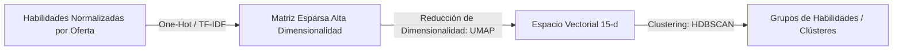

# 🧠 Lógica Core e Inferencia - Devalign

Este documento describe la lógica de inteligencia artificial, procesamiento de lenguaje natural (NLP) y los algoritmos matemáticos utilizados en Devalign para el MVP. Cubre la normalización de habilidades, la alineación de perfiles y el agrupamiento del mercado laboral.

---

## 🏷️ Normalización Semántica de Habilidades

La entrada de texto libre desde los currículos (CVs) o las vacantes de Computrabajo debe convertirse a un conjunto estandarizado de habilidades. Para lograr esto de manera eficiente y escalable, el sistema implementa una estrategia híbrida:

### 1. Coincidencia Exacta O(1) (Búsqueda en Diccionario)
* Se realiza una normalización rápida buscando el término crudo o sus sinónimos conocidos en la tabla `skill_aliases`.
* **Complejidad:** $O(1)$ en memoria (caché o indexado rápido en base de datos).
* Si el alias existe, se devuelve el `skill_id` estandarizado inmediatamente, evitando APIs externas.

### 2. Recuperación Semántica (Fallback de Embeddings)
* Si no hay coincidencia exacta, el sistema genera la representación vectorial del término utilizando la API de **Voyage AI** (modelo de embeddings densos de 1024 dimensiones).
* Se ejecuta una búsqueda de similitud de coseno contra los embeddings vectoriales persistidos en la tabla `skills` de PostgreSQL utilizando `pgvector`.
* Se calcula la Similitud de Coseno utilizando la fórmula:
  \[
  \text{Similitud}(A, B) = \frac{A \cdot B}{\|A\| \|B\|}
  \]
* **Umbral de Aceptación:** Si la similitud de coseno más alta es $\ge 0.88$, el término es homologado a la habilidad existente correspondiente.
* Si el puntaje es menor a $0.88$, el sistema clasifica el término como una nueva habilidad candidata para posterior revisión del administrador del sistema.

---

## 📐 Algoritmo de Alineación de Perfiles: Weighted Jaccard

Para determinar qué tan alineado está el perfil de un usuario con un clúster específico del mercado laboral, Devalign no utiliza similitudes planas. En su lugar, aplica un algoritmo de **Jaccard Ponderado** (Weighted Jaccard) con consideraciones para coincidencias parciales por dominios.

### Fórmula General
La alineación del usuario $U$ respecto a un clúster $C$ se define mediante la ecuación:

\[
J_W(U, C) = \frac{\sum_{s \in U \cap C} w_s + \sum_{s' \in P_{match}} 0.3 \times w_{s'}}{\sum_{s \in U \cup C} w_s}
\]

Donde:
* $U$: Conjunto de habilidades normalizadas que posee el usuario.
* $C$: Conjunto de habilidades requeridas en el clúster.
* $w_s$: Peso (importancia) de la habilidad $s$ en el clúster.
* $P_{match}$ (Coincidencia Parcial): Habilidades en las que el usuario no tiene la herramienta exacta pero posee otra de la misma categoría o dominio (ej: el usuario tiene *MySQL* y el clúster requiere *PostgreSQL*). Se otorga un crédito parcial del **30%** sobre el peso original de la habilidad.

---

## 🗄️ Dimensionalidad y Agrupamiento Offline

Para descubrir dinámicamente las tendencias del mercado a partir del conjunto de ofertas recolectadas por el scraper, Devalign utiliza un pipeline de Machine Learning no supervisado ejecutado de manera asíncrona:

### 1. Reducción de Dimensionalidad (UMAP)
* Las ofertas de trabajo contienen un espacio disperso de miles de habilidades posibles.
* El sistema aplica **UMAP** (Uniform Manifold Approximation and Projection) para proyectar la matriz de características a un espacio de **15 dimensiones** ($15\text{-d}$).
* **Razón técnica:** Mantener la estructura global y local antes de agrupar, reduciendo la maldición de la dimensionalidad sin perder la correlación semántica del perfil.

### 2. Agrupamiento Densidad-Basado (HDBSCAN)
* En el espacio reducido de 15 dimensiones, se ejecuta **HDBSCAN** (Hierarchical Density-Based Spatial Clustering of Applications with Noise).
* **Parámetros Core:** $\text{min\_cluster\_size} = 15$.
* **Ventajas del Algoritmo:**
  - No requiere predefinir la cantidad de clústeres ($K$), a diferencia de K-Means o K-Modes (que han sido eliminados por completo del sistema).
  - Tolera ruido (ofertas de trabajo atípicas o mal formateadas se catalogan como ruido en lugar de forzar su agrupación).
  - Maneja clústeres de densidades variables en el mercado laboral.

---

## 📊 Cálculo de Prioridad de Brechas Técnicas

Cuando un usuario es asignado a su clúster de mayor afinidad, las habilidades del clúster que el usuario no posee son catalogadas como brechas técnicas. Para construir un plan de acción coherente en el MVP sin incurrir en costos de procesamiento de lenguaje natural en tiempo real, las brechas se priorizan usando una puntuación de prioridad determinista:

\[
\text{Prioridad}_s = \text{Peso}_s \times \text{Frecuencia}_s
\]

Donde:
* $\text{Peso}_s$: Relevancia de la habilidad $s$ en el clúster del mercado laboral.
* $\text{Frecuencia}_s$: Frecuencia de aparición de la habilidad $s$ en las ofertas que forman el clúster.

Las brechas son ordenadas descendentemente por su $\text{Prioridad}_s$ y clasificadas en tres niveles:

| Rango de Prioridad | Nivel de Brecha | Acción del Plan |
| :--- | :--- | :--- |
| $\text{Prioridad}_s \ge 0.70$ | **Alta Prioridad** | Requiere atención inmediata. Se sugiere al usuario adquirirla primero para integrarse al clúster. |
| $0.40 \le \text{Prioridad}_s < 0.70$ | **Media Prioridad** | Recomendable de aprender una vez cubiertas las necesidades principales. |
| $\text{Prioridad}_s < 0.40$ | **Baja Prioridad** | Opcional, aporta valor complementario al perfil profesional. |

---

## 🔗 Referencias

- [🏗️ Arquitectura Técnica](ARCHITECTURE.md)
- [🤝 Contratos de Interfaz](CONTRACTS.md)
- [🗄️ Modelo de Base de Datos](DATABASE.md)
- [🗺️ Roadmap de Producto](ROADMAP.md)
- [🎯 Alcance MVP](SCOPE.md)
- [📄 Documento de Requerimientos de Producto (PRD)](PRD.md)
- [📋 Product Backlog](PRODUCT_BACKLOG.md)
- [🏃 Sprint Backlog](SPRINT_BACKLOG.md)
