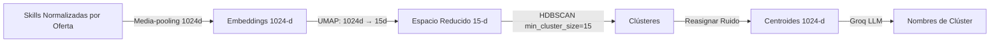

# 🧠 Lógica Core e Inferencia

Este documento describe la lógica de inteligencia artificial, procesamiento de lenguaje natural (NLP) y los algoritmos matemáticos utilizados en Devalign. Cubre la normalización de habilidades, la inferencia de grafo de conocimiento, la alineación de perfiles, el agrupamiento del mercado laboral y las métricas de competencia.

---

## Normalización Semántica de Habilidades

La entrada de texto libre desde los CVs o las vacantes debe convertirse a un conjunto estandarizado de habilidades. El sistema implementa una estrategia híbrida de tres etapas:

### 1. Coincidencia Exacta O(1) (Diccionario de Aliases)
- Búsqueda del término crudo o sus sinónimos en la tabla `skill_aliases`.
- **Complejidad:** $O(1)$ indexado en base de datos.
- Si el alias existe, se devuelve el `skill_id` estandarizado inmediatamente.

### 2. Recuperación Semántica (Embeddings Voyage AI)
- Si no hay coincidencia exacta, se genera el embedding del término usando **Voyage AI** (`voyage-4-lite`, 1024 dimensiones).
- Búsqueda de similitud de coseno contra los embeddings en la tabla `skills` usando `pgvector`:
  \[
  \text{Similitud}(A, B) = \frac{A \cdot B}{\|A\| \|B\|}
  \]
- **Umbral de Aceptación:** $\ge 0.88$ para homologar a la habilidad existente.
- Si el puntaje es menor a $0.88$, pasa a la etapa 3.

### 3. Fallback LLM
- Si no hay coincidencia semántica suficiente, se envía el término al LLM (Groq/OpenAI) para determinar si es una variante de una skill existente o una nueva skill candidata.
- Las skills no mapeadas se marcan para revisión del administrador.

> **Coherencia del Espacio Vectorial:** El proveedor de embeddings (**Voyage AI**) se mantiene unificado en desarrollo y producción para garantizar que el umbral de similitud ($\ge 0.88$) funcione de manera consistente.

---

## Inferencia Ascendente de Habilidades (Knowledge Graph)

Para evitar brechas redundantes y obtener alineaciones más precisas, Devalign implementa un paso de **inferencia ascendente** antes del cálculo de afinidad:

1. **Expansión Jerárquica:** Recorrido BFS de las relaciones `BELONGS_TO` y `REQUIRES` hacia arriba en el grafo.
   - *Ejemplo:* Si el usuario sabe `PostgreSQL`, se infiere que posee `SQL`.
2. **Prevención de Ciclos:** Conjunto de nodos visitados para evitar bucles infinitos.
3. **Trazabilidad (Provenance):** Las habilidades inferidas se marcan con `inferred_from` en el DTO, detallando qué habilidades de nivel inferior dispararon la inferencia.
4. **Optimización:** El grafo de relaciones se carga en memoria mediante una única consulta (`get_skill_graph`) en lugar de consultas recursivas.
5. **Tipos de Relaciones:** `BELONGS_TO` (pertenencia jerárquica), `REQUIRES` (dependencia técnica), `ALTERNATIVE_TO` (alternativas equivalentes).

---

## Algoritmo de Alineación de Perfiles: Weighted Jaccard

Para determinar la afinidad del perfil de un desarrollador con un clúster específico del mercado laboral, Devalign calcula un coeficiente de **Jaccard Ponderado** (Weighted Jaccard) modificado por coincidencia de dominios y frecuencia de competencias.

### Formulación Matemática

Sea $U_{tech}$ el conjunto de habilidades técnicas normalizadas y expandidas del usuario, y sea $C_{tech}$ el conjunto de habilidades técnicas del clúster del mercado laboral. La afinidad de alineación $J_W(U_{tech}, C_{tech})$ se calcula como:

\[
J_W(U_{tech}, C_{tech}) = \frac{\sum_{s \in U_{tech} \cap C_{tech}} w_s f_s + \sum_{s \in C_{tech} \setminus U_{tech}} w_s f_s p_s}{\sum_{s \in U_{tech} \cap C_{tech}} w_s f_s + \sum_{s \in C_{tech} \setminus U_{tech}} w_s f_s + \sum_{s \in U_{tech} \setminus C_{tech}} w_s}
\]

Donde:
- **$w_s$ (Peso de Habilidad):** Importancia de la habilidad $s$. Si está en el clúster, se extrae de `cluster_skills.importance_score`; si no, se usa el peso por defecto (`skills.weight`).
- **$f_s$ (Frecuencia):** Frecuencia de la habilidad en el clúster. Si $s \in C_{tech}$, se lee de las ofertas; si no, se evalúa como $1.0$.
- **$p_s$ (Coincidencia Parcial por Dominio):** Se otorga un crédito del **30%** ($p_s = 0.3$) sobre habilidades del clúster que el usuario no tiene, pero donde posee una alternativa del mismo dominio:
  \[
  p_s = \begin{cases}
  0.3 & \text{si } \exists u \in U_{tech} \text{ tal que } \text{domains}(u) \cap \text{domains}(s) \neq \emptyset \\
  0.0 & \text{en caso contrario}
  \end{cases}
  \]

---

## ICT Score

El ICT Score mide el nivel de competencia de un desarrollador en una habilidad específica en una escala de 0 a 10:

\[
\text{ICT Score} = \min\left(10, \text{self\_taught\_points} + \text{projects\_points} + \text{exp\_points} + \text{cert\_points}\right)
\]

Donde cada componente aporta:
- **Autodidacta** (`self_taught`): **1 punto** si es verdadero.
- **Proyectos personales** (`personal_projects`): **2 puntos** si es verdadero.
- **Años de experiencia** (`years_of_experience`): **3 puntos por año**.
- **Certificación** (`has_certification`): **4 puntos** si es verdadero.

El ICT Score se persiste en `profile_skills.ict_score` y se utiliza para matizar la confianza en las habilidades detectadas.

---

## Seniority Estimation

La senioridad se mapea a los niveles de responsabilidad de la taxonomía **SFIA 9** y se estima a través de dos mecanismos:

1. **Heurística de texto del CV (Fase de extracción):**
   - **Senior:** Si el texto del currículum contiene palabras clave como `architect`, `lead`, `principal`, `staff`, `senior`, `tech lead`.
   - **Mid:** Si contiene palabras como `mid`, `intermediate`, `semi-senior`.
   - **Junior:** En caso contrario.

2. **Heurística de años de experiencia (Fase de finalización):**
   - **Senior:** Si `years_experience >= 6`.
   - **Mid:** Si `years_experience` está entre 3 y 5.
   - **Junior:** Si `years_experience < 3`.

Adicionalmente, el dominio del sistema incluye el nivel de senioridad **Staff** (mapeado a niveles de responsabilidad SFIA 6+), disponible en la enumeración `SeniorityLevel` para extensiones futuras del análisis.

---

## Dimensionalidad y Agrupamiento Offline

Para clasificar las ofertas del mercado laboral IT de Perú, Devalign ejecuta un proceso de ML no supervisado en el módulo `devalign-ml`:

### 1. Reducción de Dimensionalidad (UMAP)
- Proyección a **15 dimensiones** usando **UMAP** (Uniform Manifold Approximation and Projection).
- Parámetros: `n_neighbors=15`, `n_components=15`, `min_dist=0.0`, `metric=cosine`.

### 2. Agrupamiento Densidad-Basado (HDBSCAN)
- **HDBSCAN** con `min_cluster_size=15`, `min_samples=2`, `metric=euclidean`.
- Se descartan K-Means y K-Modes por requerir un número fijo de clústeres.

### 3. Post-procesamiento
- **Silhouette Score** (excluyendo ruido) para evaluar calidad.
- **Reasignación de ruido** al centroide más cercano.
- **Cálculo de centroides** en 1024 dimensiones.
- **Nombrado de clústeres** mediante Groq LLM (`llama-3.3-70b-versatile`) en batch con fallback individual.

---

## Priorización de Brechas Técnicas

Cuando un usuario es comparado contra su clúster de mayor afinidad, las habilidades del clúster que no posee se catalogan como brechas. El motor calcula un puntaje de prioridad:

\[
\text{Prioridad}_s = \text{Peso}_s \times \text{Frecuencia}_s
\]

Donde:
- $\text{Peso}_s$ (`importance_score`): Peso de relevancia en el clúster.
- $\text{Frecuencia}_s$: Frecuencia en las ofertas del clúster.

Las brechas se clasifican en tres niveles:

| Prioridad | Categoría | Impacto |
| :--- | :--- | :--- |
| $\ge 2.0$ | **Crítica (critical)** | Indispensable. Aprender de inmediato. |
| $1.0 - 2.0$ | **Alta (high)** | Alto valor diferencial. |
| $< 1.0$ | **Media (medium)** | Complementaria u opcional. |

---

## Referencias

- [Arquitectura Técnica](ARCHITECTURE.md)
- [Contratos de Interfaz](CONTRACTS.md)
- [Modelo de Base de Datos](DATABASE.md)
- [Roadmap de Producto](ROADMAP.md)
- [Alcance MVP](SCOPE.md)
- [Documento de Requerimientos de Producto (PRD)](PRD.md)
- [Product Backlog](PRODUCT_BACKLOG.md)
- [Sprint Backlog](SPRINT_BACKLOG.md)
