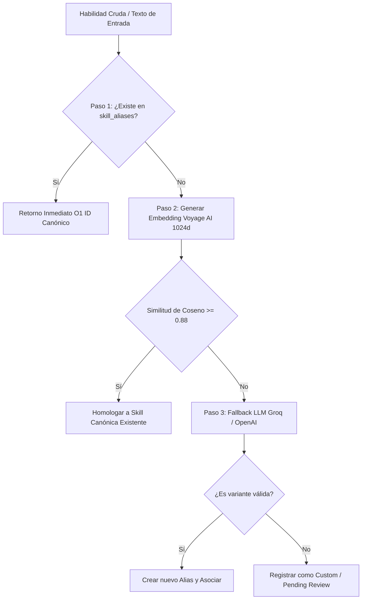
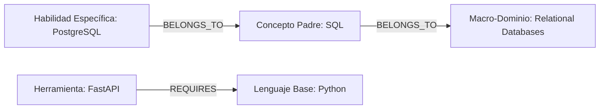
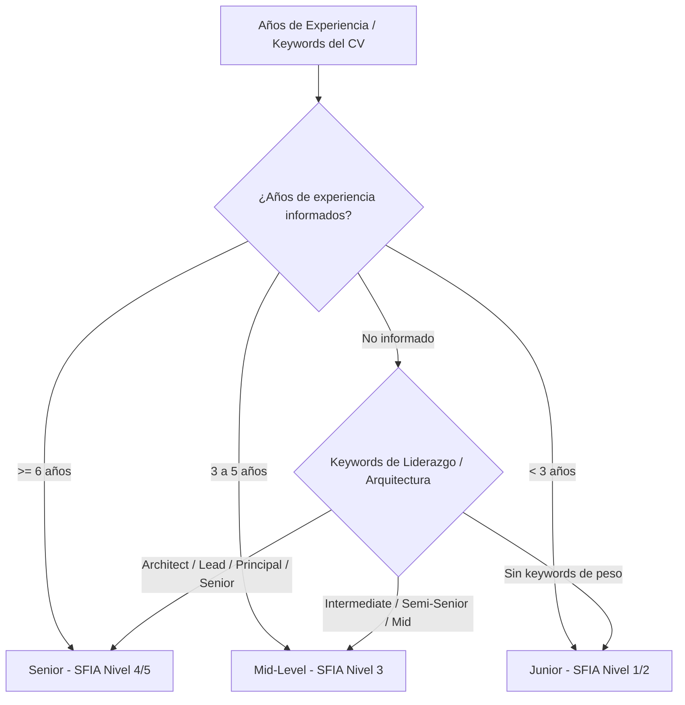
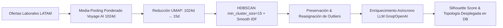

# 🧠 Lógica Core e Inferencia

Este documento describe la formulación matemática, los algoritmos de procesamiento de lenguaje natural (NLP), la inferencia sobre el grafo de conocimiento y los pipelines de Machine Learning implementados en el sistema Devalign.

---

## 1. Normalización Semántica de Habilidades

El sistema convierte las menciones no estructuradas de habilidades en un catálogo canónico normalizado mediante un algoritmo determinístico e híbrido de tres etapas:

### Paso 1: Coincidencia Exacta $O(1)$ (Diccionario de Aliases)
Búsqueda indexada en `skill_aliases.alias_name`. Si existe coincidencia exacta con el término normalizado (minúsculas y sin caracteres especiales), se retorna inmediatamente la clave canónica `skills.skill_id` con complejidad temporal $O(1)$.

### Paso 2: Recuperación Semántica Vectorial (Voyage AI)
Si no hay coincidencia exacta, se genera el vector del término usando **Voyage AI** (`voyage-4-lite`, 1024 dimensiones) y se evalúa la similitud de coseno contra el espacio vectorial persistido en PostgreSQL (`pgvector`):

\[
\text{Similitud}(u, v) = \frac{u \cdot v}{\|u\|_2 \|v\|_2}
\]

- **Umbral de Corte:** $\ge 0.88$.
- Si supera el umbral, se asocia automáticamente a la habilidad más cercana.

### Paso 3: Fallback LLM y Gobernanza de Catálogo
Si la similitud vectorial es $< 0.88$, se invoca el motor LLM con validación de esquema para discernir si el término es un sinónimo semántico de un concepto existente o una habilidad técnica emergente. Si es nueva, se clasifica en estado `pending_review` o `canonical` según las políticas de gobernanza de la taxonomía.

---

## 2. Inferencia Ascendente sobre Grafo de Conocimiento (Knowledge Graph)

Para evitar brechas artificiales y reflejar la maestría conceptual implícita, el sistema ejecuta una inferencia ascendente sobre las aristas de `skill_relations` antes de evaluar afinidades:

### Reglas de Inferencia y Recorrido
1. **Tipos de Aristas Transitivas:**
   - `BELONGS_TO`: El nodo hijo es una implementación concreta del nodo padre (ej. `PostgreSQL` $\to$ `SQL`).
   - `REQUIRES`: El nodo hijo presupone dominio técnico del nodo padre (ej. `Angular` $\to$ `TypeScript`).
2. **Algoritmo de Recorrido:** Búsqueda en anchura (BFS) sobre el grafo cargado en memoria (`get_skill_graph`), evitando consultas recursivas a la base de datos.
3. **Control de Ciclos y Deduplicación:** Conjunto de nodos visitados en memoria con complejidad $O(V + E)$.
4. **Trazabilidad de Proveniencia (`inferred_from`):** Toda habilidad incorporada por inferencia registra la lista de habilidades base que la originaron.

---

## 3. Algoritmo de Alineación de Perfiles: Weighted Jaccard Modificado

La afinidad entre las competencias técnicas del desarrollador y una especialidad del mercado se calcula mediante un coeficiente de **Jaccard Ponderado** que incorpora la frecuencia real de demanda de cada habilidad en el clúster y otorga créditos por afinidad de dominio.

### Formulación Matemática

Sea $U_{tech}$ el conjunto de habilidades técnicas normalizadas y expandidas del usuario, y sea $C_{tech}$ el conjunto de habilidades técnicas requeridas en el clúster objetivo. El puntaje de alineación $J_W(U_{tech}, C_{tech})$ se define como:

\[
J_W(U_{tech}, C_{tech}) = \frac{\sum_{s \in U_{tech} \cap C_{tech}} w_s f_s + \sum_{s \in C_{tech} \setminus U_{tech}} w_s f_s p_s}{\sum_{s \in U_{tech} \cap C_{tech}} w_s f_s + \sum_{s \in C_{tech} \setminus U_{tech}} w_s f_s + \sum_{s \in U_{tech} \setminus C_{tech}} w_s}
\]

Donde:
- **$w_s$ (Peso de la Habilidad):** Extraído de `cluster_skills.importance_score` para habilidades pertenecientes al clúster, o `skills.weight` para habilidades externas del usuario.
- **$f_s$ (Frecuencia en el Mercado):** Frecuencia de aparición de la habilidad dentro de las ofertas del clúster ($f_s \in (0, 1]$). Para habilidades exclusivas del usuario se asigna $f_s = 1.0$.
- **$p_s$ (Crédito Parcial por Dominio Cruzado):** Bonificación del **30%** ($p_s = 0.30$) otorgada sobre habilidades no dominadas por el usuario cuando este demuestra dominio en otra tecnología del mismo macro-dominio:
  \[
  p_s = \begin{cases}
  0.30 & \text{si } \exists u \in U_{tech} \text{ tal que } \text{core\_domains}(u) \cap \text{core\_domains}(s) \neq \emptyset \\
  0.00 & \text{en caso contrario}
  \end{cases}
  \]

---

## 4. Índice de Competencia Técnica (ICT Score)

El **ICT Score** evalúa el nivel de dominio y confianza en cada habilidad del desarrollador en una escala continua de $0.0$ a $10.0$:

\[
\text{ICT Score} = \min\left(10.0, P_{\text{autodidacta}} + P_{\text{proyectos}} + P_{\text{experiencia}} + P_{\text{certificación}}\right)
\]

### Tabla de Puntuación de Evidencias

| Fuente de Evidencia | Variable | Puntos Otorgados | Justificación |
|---|---|---|---|
| **Autodidacta** | `self_taught` | $+1.0$ punto | Demuestra proactividad y capacidad de aprendizaje continuo. |
| **Proyectos Personales** | `personal_projects` | $+2.0$ puntos | Demuestra aplicación práctica en código ejecutable independiente. |
| **Años de Experiencia** | `years_of_experience` | $+3.0$ puntos / año | Factor dominante que refleja horas de exposición en producción. |
| **Certificación Oficial** | `has_certification` | $+4.0$ puntos | Validación formal emitida por entidades u organismos de la industria. |

---

## 5. Estimación Dinámica de Seniority

La senioridad del desarrollador se alinea con los niveles de responsabilidad del marco **SFIA 9** y se calcula de forma dinámica mediante la función de módulo `_derive_seniority`:

- **Nivel Staff (SFIA 6+):** Soportado en el dominio para perfiles con liderazgo técnico multiplataforma y dirección de arquitectura.

---

## 6. Pipeline de Machine Learning Offline (`devalign-ml`)

El descubrimiento y parametrización de clústeres del mercado laboral IT en LATAM se procesa mediante un pipeline no supervisado:

### Parámetros y Configuración del Pipeline

| Etapa | Algoritmo / Servicio | Parámetros Clave | Propósito |
|---|---|---|---|
| **Representación** | Voyage AI (`voyage-4-lite`) | Dimensión: 1024 | Vectores densos de alta fidelidad semántica. |
| **Ponderación** | Smooth IDF | $\text{IDF}(t) = \ln\left(1 + \frac{N - n_t + 0.5}{n_t + 0.5}\right)$ | Reduce el impacto de herramientas ofimáticas genéricas. |
| **Reducción** | UMAP | `n_neighbors=15`, `n_components=15`, `min_dist=0.0`, `metric=cosine` | Captura manifolds no lineales preservando vecindades locales. |
| **Clustering** | HDBSCAN | `min_cluster_size=15`, `min_samples=2`, `metric=euclidean` | Detecta densidades naturales sin imponer número prefijado $K$. |
| **Enriquecimiento** | Groq / OpenAI LLM | `temperature=0.1`, validación Pydantic | Generación de nombres legibles de especialidad y roles compatibles. |

---

## 7. Priorización de Brechas Técnicas

Las habilidades del clúster de máxima afinidad que no están cubiertas por el desarrollador se ordenan según su impacto:

\[
\text{Impacto de Brecha}_s = \text{importance\_score}_s \times \text{frecuencia\_mercado}_s
\]

| Nivel de Prioridad | Criterio de Impacto | Acción Recomendada en la UI |
|---|---|---|
| 🔴 **Critical** | $\text{Impacto} \ge 2.0$ y $f_s \ge 0.60$ | Habilidad imprescindible del stack; debe abordarse de inmediato. |
| 🟡 **High** | $1.0 \le \text{Impacto} < 2.0$ | Habilidad de alta demanda que incrementa significativamente la empleabilidad. |
| 🔵 **Medium** | $\text{Impacto} < 1.0$ | Tecnología complementaria o herramienta accesoria del ecosistema. |

---

## 🔗 Referencias

- [🏗️ Arquitectura Técnica](ARCHITECTURE.md)
- [🤝 Contratos de Interfaz](CONTRACTS.md)
- [🗄️ Modelo de Base de Datos](DATABASE.md)
- [🗺️ Roadmap de Producto](ROADMAP.md)
- [🎯 Alcance MVP](SCOPE.md)
- [📄 Documento de Requerimientos de Producto (PRD)](PRD.md)
- [📋 Product Backlog](PRODUCT_BACKLOG.md)
- [🏃 Sprint Backlog](SPRINT_BACKLOG.md)
