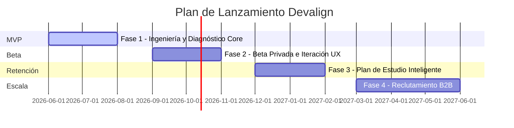

# 🗺️ Roadmap de Producto - Devalign

Este documento describe la estrategia de lanzamiento y evolución del producto Devalign, organizada en fases incrementales de entrega de valor para los usuarios y la organización.

---

## 📅 Línea de Tiempo del Producto

---

## 🚀 Detalle de Fases de Producto

### 📍 Fase 1: MVP (Ingeniería y Diagnóstico Core)
* **Objetivo:** Construir la base de datos relacional del mercado de habilidades y habilitar el perfilamiento automatizado.
* **Características Clave:**
  - Carga manual de CV en formato PDF/DOCX.
  - Normalización híbrida de habilidades (exact match + embeddings Voyage AI).
  - Algoritmo de alineación por Jaccard Ponderado contra clústeres.
  - Panel básico de diagnóstico de brechas técnicas y priorización determinista ($Prioridad = Peso \times Frecuencia$).
  - Limpieza de modelos legacy (K-Modes descartado).
* **Infraestructura:** API FastAPI en Railway/Koyeb, frontend Next.js 16 en Vercel, PostgreSQL con extensión `pgvector` en Supabase.
* **Criterio de Salida:** Carga y procesamiento exitoso de currículos con una tasa de normalización correcta de habilidades técnica superior al 85%.

### 📍 Fase 2: Beta (Beta Privada y Pública)
* **Objetivo:** Lanzar una versión controlada del producto a usuarios reales para recolectar feedback de UX y validar la precisión de la alineación profesional.
* **Características Clave:**
  - Registro abierto para grupo de prueba cerrado (Beta Privada).
  - Rediseño visual del panel de diagnóstico adaptado a dispositivos móviles.
  - Panel interactivo para actualizar habilidades manualmente de forma intuitiva.
  - Métricas de telemetría de usuario internas para rastrear el tiempo de permanencia y las áreas más consultadas.
* **Criterio de Salida:** Corrección de incidencias reportadas en UX y validación del 90% de coincidencia subjetiva por parte de los profesionales evaluados en la Beta.

### 📍 Fase 3: Retención (Recomendaciones y Plan de Estudio)
* **Objetivo:** Incrementar la recurrencia de los usuarios en la plataforma ayudándoles a cerrar sus brechas de habilidades identificadas.
* **Características Clave:**
  - Generación de planes de estudio interactivos asíncronos apoyados en LLM para guiar el cierre de brechas.
  - Integración de recursos de aprendizaje externos (Cursos de Udemy, Coursera, YouTube, documentación oficial).
  - Guardado de avances de aprendizaje e historial de progreso en base de datos (`roadmaps` y `roadmap_steps`).
  - Notificaciones periódicas sobre nuevas vacantes que encajan en el clúster objetivo.
* **Criterio de Salida:** Ratio de retención semanal (WAU/MAU) superior al 25% tras el lanzamiento del plan de aprendizaje interactivo.

### 📍 Fase 4: Escala (Reclutamiento B2B e Integraciones)
* **Objetivo:** Monetizar la plataforma permitiendo a empresas encontrar talento altamente alineado con sus necesidades y expandir los canales de captación.
* **Características Clave:**
  - Dashboard B2B para reclutadores, con filtros avanzados de concordancia de habilidades reales.
  - Sincronización automática y en tiempo real del scraper laboral con API de terceros.
  - Generación de ofertas de empleo optimizadas semánticamente basadas en las habilidades del clúster.
  - Conexión mediante Webhooks con Sistemas de Seguimiento de Candidatos (ATS) corporativos.
* **Criterio de Salida:** Conexión exitosa del primer cliente corporativo piloto y procesamiento de búsquedas de candidatos en menos de 500ms.

---

## 🔗 Referencias

- [🏗️ Arquitectura Técnica](ARCHITECTURE.md)
- [🤝 Contratos de Interfaz](CONTRACTS.md)
- [🗄️ Modelo de Base de Datos](DATABASE.md)
- [🧠 Lógica Core e Inferencia](MODEL.md)
- [🎯 Alcance MVP](SCOPE.md)
- [📄 Documento de Requerimientos de Producto (PRD)](PRD.md)
- [📋 Product Backlog](PRODUCT_BACKLOG.md)
- [🏃 Sprint Backlog](SPRINT_BACKLOG.md)
