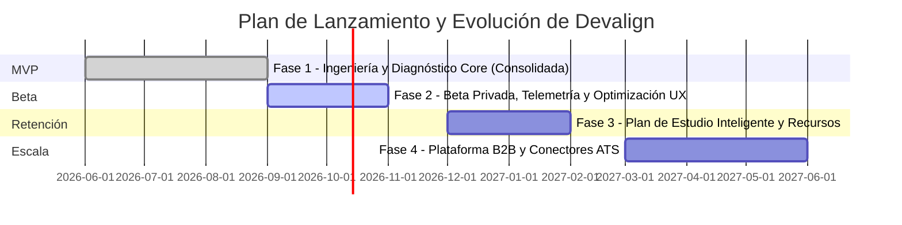

# 🗺️ Roadmap de Producto

Este documento describe la estrategia de lanzamiento, evolución técnica y fases del producto Devalign, organizadas en entregas progresivas de valor.

---

## 📅 Línea de Tiempo del Producto

---

## 🚀 Detalle de Fases de Producto

### 📍 Fase 1: MVP (Ingeniería y Diagnóstico Core) — *Consolidada*
* **Objetivo:** Construir la infraestructura relacional de habilidades, el pipeline de clustering de mercado LATAM, la extracción en dos fases de currículums y el panel de diagnóstico interactivo.
* **Características Entregadas:**
  - Carga asíncrona de CV (PDF/DOCX) en 2 fases: Extracción estructurada (`skills_detected`) y Puerta de validación humana antes del diagnóstico (`completed`).
  - Catálogo de gobernanza de habilidades con taxonomía estándar basada en **Lightcast Open Skills**, SFIA 9 y SWECOM.
  - Normalización híbrida: Coincidencia exacta $O(1)$ en aliases $\to$ Embeddings Voyage AI (`voyage-4-lite`, 1024d, $\ge 0.88$) $\to$ Fallback LLM estructurado.
  - Inferencia ascendente en grafo de conocimiento (`BELONGS_TO` / `REQUIRES`) con trazabilidad (`inferred_from`).
  - Algoritmo de alineación por **Weighted Jaccard** con 30% de crédito parcial por coincidencia de macro-dominios.
  - Cálculo de Índice de Competencia Técnica (**ICT Score** 0-10) y derivación dinámica de senioridad.
  - Dashboard Bento-Grid con radar de afinidad, desglose de brechas priorizadas (`critical`, `high`, `medium`) y topología interactiva de grafo en 2D/3D.
  - Autocompletado de habilidades con clasificación de estándares en tiempo real (`SkillAutocomplete`).
  - Scraping multi-portal LATAM (Computrabajo en 5 países, GetOnBoard, Remotive, WeWorkRemotely, Arbeitnow) con persistencia directa en Supabase.
  - Pipeline de clustering UMAP + HDBSCAN con Smooth IDF, preservación de outliers y nombrado LLM con validación Pydantic.
  - 15 tablas relacionales y 23 migraciones Alembic gestionadas en `devalign-api`.
* **Criterio de Salida:** Procesamiento exitoso de currículos con una tasa de normalización correcta superior al 85% y recálculo dinámico en menos de 2 segundos.

---

### 📍 Fase 2: Beta (Beta Privada y Pública) — *En Ejecución*
* **Objetivo:** Desplegar una versión controlada a grupos cerrados de desarrolladores para validar la precisión del diagnóstico percibido, monitorear la usabilidad de la UI y recopilar retroalimentación cualitativa.
* **Características Clave:**
  - Apertura de registro para comunidad de desarrolladores en lista de espera (Beta Privada).
  - Telemetría de interacción para registrar patrones de navegación y tiempos de visualización en brechas de habilidades.
  - Refinamiento de componentes visuales en dispositivos móviles y monitores ultra-wide.
  - Auditoría de la ontología de habilidades con líderes técnicos y reclutadores de la industria en LATAM.
* **Criterio de Salida:** Corrección de incidencias críticas de usabilidad y obtención de una tasa de satisfacción superior al 90% en la precisión del diagnóstico emitido.

---

### 📍 Fase 3: Retención (Plan de Estudio Inteligente y Recursos)
* **Objetivo:** Guiar activamente al desarrollador en el cierre de sus brechas técnicas para aumentar el uso recurrente de la plataforma.
* **Características Clave:**
  - Generación de planes de estudio asíncronos apoyados en LLM para cada brecha técnica de alta prioridad.
  - Vinculación con recursos de aprendizaje externos (documentación oficial, cursos abiertos, repositorios de práctica).
  - Persistencia de hitos de aprendizaje y marcado de avance paso a paso (`roadmaps` y `roadmap_steps`).
  - Notificaciones periódicas sobre la evolución de la demanda laboral en las especialidades del usuario.
* **Criterio de Salida:** Tasa de retención de usuarios activos semanales (WAU/MAU) superior al 25%.

---

### 📍 Fase 4: Escala (Plataforma B2B e Integraciones ATS)
* **Objetivo:** Conectar el talento evaluado con empresas contratantes que buscan perfiles alineados a sus stacks tecnológicos específicos.
* **Características Clave:**
  - Panel B2B para reclutadores técnicos con búsqueda relacional y filtros semánticos basados en el grafo de habilidades.
  - Automatización programada de scraping y re-entrenamiento periódico del modelo de clustering en la nube.
  - Integración mediante webhooks y API con sistemas ATS (Applicant Tracking Systems) corporativos.
  - Generador semántico de ofertas laborales para optimizar los requisitos de vacantes corporativas.
* **Criterio de Salida:** Tiempo de búsqueda de candidatos inferior a 500ms y primer acuerdo piloto con empresas contratantes.

---

## 🔗 Referencias

- [🏗️ Arquitectura Técnica](ARCHITECTURE.md)
- [🤝 Contratos de Interfaz](CONTRACTS.md)
- [🗄️ Modelo de Base de Datos](DATABASE.md)
- [🧠 Lógica Core e Inferencia](MODEL.md)
- [🎯 Alcance MVP](SCOPE.md)
- [📄 Documento de Requerimientos de Producto (PRD)](PRD.md)
- [📋 Product Backlog](PRODUCT_BACKLOG.md)
- [🏃 Sprint Backlog](SPRINT_BACKLOG.md)
