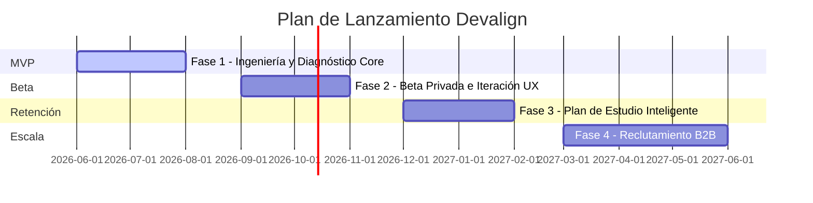

# 🗺️ Roadmap de Producto

Este documento describe la estrategia de lanzamiento y evolución del producto Devalign, organizada en fases incrementales de entrega de valor para los usuarios y la organización.

---

## 📅 Línea de Tiempo del Producto

---

## 🚀 Detalle de Fases de Producto

### 📍 Fase 1: MVP (Ingeniería y Diagnóstico Core)
* **Objetivo:** Construir la base de datos relacional de habilidades de mercado, habilitar el perfilamiento inteligente automatizado y permitir la personalización interactiva inicial del perfil del desarrollador.
* **Características Clave:**
  - Carga manual de CV en formato PDF/DOCX con análisis y extracción asíncrona en segundo plano (polling).
  - Normalización híbrida de habilidades (exact match + embeddings Voyage AI `voyage-4-lite` $\ge 0.88$).
  - Inferencia ascendente de habilidades mediante grafo de conocimiento (arcos `BELONGS_TO` / `REQUIRES`) con trazabilidad (`inferred_from`).
  - Algoritmo de alineación por Jaccard Ponderado modificado por frecuencia y dominio.
  - Dashboard de diagnóstico Bento-Grid responsivo (fortalezas, brechas priorizadas `critical`/`high`/`medium` y afinidades secundarias).
  - Edición en caliente del perfil y de las habilidades del catálogo con recálculo dinámico instantáneo.
  - Historial, descarga, eliminación y re-análisis de documentos CV.
  - Mapa interactivo de grafo de habilidades en 2D/3D (`react-force-graph`).
  - Evaluación voluntaria contra clústeres/especialidades específicas del mercado.
  - Limpieza de modelos legacy (K-Modes descartado; UMAP + HDBSCAN en lote offline).
* **Infraestructura:** API FastAPI en Railway/Koyeb, frontend Next.js 16 en Vercel, PostgreSQL con extensión `pgvector` en Supabase.
* **Criterio de Salida:** Procesamiento exitoso de currículos con una tasa de normalización correcta de habilidades técnica superior al 85% y recálculo de perfil en menos de 2 segundos tras cambios manuales.

### 📍 Fase 2: Beta (Beta Privada y Pública)
* **Objetivo:** Lanzar una versión controlada del producto a usuarios reales para recolectar feedback de usabilidad de la interfaz, registrar telemetría y validar la precisión percibida del diagnóstico técnico.
* **Características Clave:**
  - Registro abierto para grupo de prueba cerrado (Beta Privada).
  - Ajustes de UX de precisión basados en el feedback en dispositivos móviles y de escritorio.
  - Integración de herramientas de telemetría y análisis de uso para rastrear flujos de clics y tiempos de permanencia en las habilidades de brecha.
  - Auditoría de taxonomía de habilidades por expertos del sector (cotejo con estándares de reclutadores locales).
* **Criterio de Salida:** Corrección de incidencias de usabilidad críticas y obtención de una tasa de concordancia subjetiva superior al 90% por parte de los profesionales evaluados en la Beta.

### 📍 Fase 3: Retención (Recomendaciones y Plan de Estudio)
* **Objetivo:** Incrementar la recurrencia y retención de los desarrolladores en la plataforma guiando activamente el cierre de sus brechas técnicas.
* **Características Clave:**
  - Generación de planes de estudio interactivos asíncronos apoyados en LLM para cada brecha técnica de alta prioridad.
  - Integración de catálogo de recursos de aprendizaje externos sugeridos (Udemy, Coursera, YouTube, documentación técnica oficial).
  - Guardado de avances de estudio y marcado de completitud paso a paso con persistencia en DB (`roadmaps` y `roadmap_steps`).
  - Alertas semanales opcionales sobre nuevas vacantes añadidas al clúster de especialidad objetivo del usuario.
* **Criterio de Salida:** Ratio de retención semanal (WAU/MAU) superior al 25% tras el lanzamiento del módulo de estudio interactivo.

### 📍 Fase 4: Escala (Reclutamiento B2B e Integraciones)
* **Objetivo:** Monetizar la plataforma permitiendo a empresas del sector IT encontrar programadores con las habilidades y stacks exactos demandados, automatizando los pipelines de scraping.
* **Características Clave:**
  - Dashboard B2B para reclutadores, con filtros avanzados de búsqueda relacional semántica de candidatos.
  - Orquestación automática en la nube del scraper de Computrabajo para sincronización periódica de vacantes reales en tiempo real.
  - Generador automático de ofertas de empleo con IA optimizado semánticamente para encajar con los clústeres.
  - Conexión vía API / Webhooks con sistemas ATS (Applicant Tracking Systems) corporativos.
* **Criterio de Salida:** Procesamiento y visualización de búsquedas de candidatos en menos de 500ms y primer cliente piloto corporativo conectado.

---

## 🔗 Referencias

- [🏗️ Arquitectura Técnica](ARCHITECTURE.md)
- [🤝 Contratos de Interfaz](CONTRACTS.md)
- [🗄️ Modelo de Base de Datos](DATABASE.md)
- [🧠 Lógica Core e Inferencia](MODEL.md)
- [🎯 Alcance MVP](SCOPE.md)
- [📄 Documento de Requerimientos de Producto (PRD)](PRD.md)
- [📋 Product Backlog](PRODUCT_BACKLOG.md)
- [🏃 Sprint Backlog](SPRINT_BACKLOG.md)
